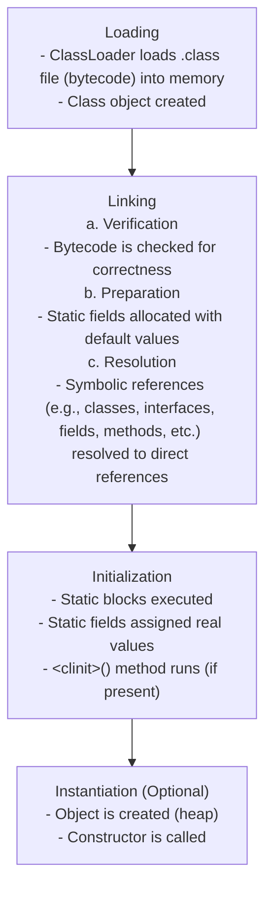

# Homework 1 — Java OOP
**Author: M. Yang**

## Question 1
> Fundamental concepts of Java OOP - A PIE
> * [Abstraction—Question 16](#question-16)
> * Polymorphism
> * Inheritance
> * Encapsulation (access modifiers, getter/setter)

```java
// Encapsulation
class Animal {
    private String name;
    private int age;

    public Animal(String name, int age) {
        this.name = name;
        this.age = age;
    }

    // Getters and setters
    public String getName() {
        return name;
    }

    public void setName(String name) {
        this.name = name;
    }

    public int getAge() {
        return age;
    }

    public void setAge(int age) {
        if (age >= 0) {
            this.age = age;
        }
    }

    // Method to be overridden (runtime polymorphism)
    public void makeSound() {
        System.out.println("Some generic animal sound");
    }

    // Method overloading (compile-time polymorphism)
    public void makeSound(String mood) {
        System.out.println(name + " makes a sound when it's " + mood);
    }

    public void makeSound(int volumeLevel) {
        System.out.println(name + " makes a sound at volume level " + volumeLevel);
    }
}

// Inheritance
class Dog extends Animal {
    public Dog(String name, int age) {
        super(name, age);
    }

    // Overriding method
    @Override
    public void makeSound() {
        System.out.println(getName() + " says: Woof!");
    }
}

class Cat extends Animal {
    public Cat(String name, int age) {
        super(name, age);
    }

    @Override
    public void makeSound() {
        System.out.println(getName() + " says: Meow!");
    }
}

// Main class
public class Main {
    public static void main(String[] args) {
        Dog dog = new Dog("Buddy", 3);
        Cat cat = new Cat("Whiskers", 2);

        Animal[] animals = new Animal[] { dog, cat };
        
        // test overriding
        for (Animal animal : animals) {
            animal.makeSound();
        }
        
        // test overloading
        dog.makeSound("happy");
        cat.makeSound(5);
    }
}
```


## Question 2
> Wrapper classes

In Java, wrapper classes are object representations of the primitive data types.
Each wrapper class wraps a **primitive value inside an object**.

| Primitive Type | Wrapper Class |
|----------------|---------------|
| `int`          | `Integer`     |
| `double`       | `Double`      |
| `float`        | `Float`       |
| `char`         | `Character`   |
| `byte`         | `Byte`        |
| `short`        | `Short`       |
| `long`         | `Long`        |
| `boolean`      | `Boolean`     |

### Why Wrapper Classes:
#### 1. To bring object-oriented features to primitives
Java is an object-oriented language, but primitive types (int, double, etc.) are not objects.
Wrapper classes provide a way to treat primitive values as objects, allowing them to:
- Be stored in object-only structures (e.g., **Collections**)
- Have **methods** and behavior (like parsing, comparing, converting)

#### 2. To enable uniform treatment of data
Java treats objects and primitives differently in many contexts.
Wrappers allow you to treat primitives uniformly as objects,
simplifying APIs and tools that expect objects.

#### 3. To enable features like nullability
Primitive types can't be null, but objects can.
Wrappers allow you to represent "no value" (**null**) — useful in databases, APIs, or optional fields.


## Question 3
> `HashMap` vs. `HashTable`

| Feature                    | `HashMap`                                          | `HashTable`                                  |
|----------------------------|----------------------------------------------------|----------------------------------------------|
| **Thread Safety**          | ❌ Not synchronized (not thread-safe)               | ✅ Synchronized (thread-safe)                 |
| **Performance**            | ✅ Faster (no synchronization overhead)             | ❌ Slower due to synchronization              |
| **Null Keys/Values**       | ✅ Allows one `null` key and multiple `null` values | ❌ Does **not** allow any `null` key or value |
| **Legacy Status**          | ✅ Part of Java Collections Framework               | ❗ Legacy class (pre-Java 1.2)                |
| **Iterator Type**          | Fail-fast iterator                                 | Not fail-fast (less consistent)              |
| **Preferred for New Code** | ✅ Recommended                                      | ❌ Avoid for new code                         |


## Question 4
> String pool and string immunity

### What is String Pool in Java?
The **String Pool** (also called the **String Intern Pool**) is a special memory area inside the **Java heap** that stores **unique String literals**.

Whenever you create a String like this:
```java
String s1 = "hello";
String s2 = "hello";
```
Java does **not** create two objects. Instead, both `s1` and `s2` point to the **same object** in the String pool.

### Why String Pool
#### 1. To save memory
Instead of creating multiple copies of identical strings, Java stores only one copy in the pool.

#### 2. To improve performance
**Reusing** immutable string objects is faster than creating new ones — especially in applications where strings are used heavily (like web servers, compilers, parsers).

### String Immunity
In Java, String is **immutable**, meaning **once created, it cannot be changed**.

**Benefits:**

#### 1. Thread safety
Immutable objects are inherently thread-safe (no synchronization needed).

#### 2. Security
Strings are often used for passwords, file paths, etc. If they were mutable, they could be altered unexpectedly.

#### 3. Hashing consistency
Since string values don’t change, they make reliable keys in hash-based collections (HashMap, HashSet).

#### 4. String pool depends on it
If strings could change, they can't be reused safely from the pool.


## Question 5
> Garbage Collector Types

Garbage Collection is the process by which the Java Virtual Machine (**JVM**) **automatically reclaims memory** by removing objects that are **no longer reachable or needed**.

**Types of GC:**

| GC Type                            | Description                                                                       |
|------------------------------------|-----------------------------------------------------------------------------------|
| **Serial GC**                      | Single-threaded, simple, good for small apps                                      |
| **Parallel GC**                    | Multi-threaded for both minor and major collections, good throughput              |
| **CMS (Concurrent Mark Sweep) GC** | Collects in phases with minimal pause time, deprecated as of Java 9               |
| **G1 GC (Garbage First)**          | Prioritizes low-pause-time and is good for large heaps; default since Java 9      |
| **ZGC (Z Garbage Collector)**      | Scalable, low-latency GC; supports heaps from MBs to TBs with pauses <10ms        |
| **Shenandoah GC**                  | Also low-pause-time GC, developed by Red Hat; pauses are independent of heap size |


## Question 6
> Access modifiers

| Access Modifier | Scope                                                                                   | Implicitly Used if Not Declared    |
|-----------------|-----------------------------------------------------------------------------------------|------------------------------------|
| `public`        | Accessible from **anywhere** (same package or different package).                       | Interface methods                  |
| `protected`     | Accessible within the **same package** and **subclasses** (even in different packages). |                                    |
| `default`       | Accessible only within the **same package** (no modifier specified).                    | Interfaces, classes, class members |
| `private`       | Accessible only within the **same class**.                                              |                                    |


## Question 7
> `final` keyword

| Modifier Context     | Purpose         |
|----------------------|-----------------|
| `final` with Fields  | Constant        |
| `final` with Methods | Not overridable |
| `final` with Classes | Not extendable  |


## Question 8
> `static` keyword

| **Usage**                 | **Description**                                                                                                                          | **Example**                                                                        |
|---------------------------|------------------------------------------------------------------------------------------------------------------------------------------|------------------------------------------------------------------------------------|
| **Static Fields**         | Shared across all instances of the class. Same value for all objects.                                                                    | `static int count = 0;`                                                            |
| **Static Methods**        | Belong to the class itself, not to an instance. Can be called without creating an object.                                                | Define: `public static void displayCount() {}`<br/> Invoke: `Counter.displayCount` |
| **Static Nested Classes** | A class inside another class that does **not reply on** an instance of the outer class. It can access static members of the outer class. | `static class NestedClass {}`                                                      |


## Question 9
> Polymorphism: Overriding vs. Overloading

| **Feature**           | **Overloading**                                               | **Overriding**                                                                 |
|-----------------------|---------------------------------------------------------------|--------------------------------------------------------------------------------|
| **Method Signature**  | Same method name, but **different parameters (type/number)**. | Same method name, same parameters.                                             |
| **Polymorphism Type** | **Compile-time** polymorphism (resolved at compile time).     | **Runtime** polymorphism (resolved at runtime).                                |
| **Class Context**     | Happens within the **same class**.                            | Happens in **inheritance**.                                                    |
| **Purpose**           | To provide multiple ways to call a method.                    | To customize or modify inherited behavior from a superclass.                   |
| **Return Type**       | **Return type** can be the **same or different**.             | Must have the **same return type**.                                            |
| **Access Modifier**   | **No restriction**.                                           | Access modifier must be the **same or more permissive** in overridden methods. |


## Question 10
> Method signature and polymorphism

Java method signature consists of:
- method name
- parameter types (in order)

| **Overloading**                                                   | **Overriding**     |
|-------------------------------------------------------------------|--------------------|
| Same method name, different param types (**different signature**) | **Same signature** |


## Question 11
> `super` vs. `this`

| **Keyword** | **Refers To**                  | **Used For**                                                                      | **Context of Use**               |
|-------------|--------------------------------|-----------------------------------------------------------------------------------|----------------------------------|
| `this`      | **Current** class object       | Accessing current class members, resolving naming conflicts, constructor chaining | Within the same class            |
| `super`     | **Parent** (superclass) object | Accessing parent class members or constructors                                    | In a subclass (with inheritance) |


## Question 12
> `equals()` and `hashCode()`

### `equals()`
The default implementation compares memory addresses (i.e., reference equality) of two objects.
If comparison between the object themselves is the desired behavior, then `equals()` must be overridden.

### `hashCode()`
The default implementation returns an integer value for the object as a hash code value (to be used in hash-based collections).

### Working with a `HashMap`
1. Java calls `hashCode()` on the key.
2. It uses the hash code to compute an index (e.g., `hash % array.length`) into an internal bucket array.
3. If no collision: the entry is added.
4. If collision (another key with the same hash code):
   - Java checks `equals()` to determine whether:
     - It's the same key (update the value).
     - A different key (add to the linked list or tree inside the bucket).


## Question 13
> Java load sequence

The Java load sequence (also called the **class loading and initialization sequence**) describes how the **JVM loads, links, and initializes classes** before they are used at runtime.



### Triggered When:
- A class is instantiated (`new MyClass()`)
- A static method or variable is accessed
- Reflection is used (`Class.forName("MyClass")`)


## Question 14
> Polymorphism

See [Question 1](#question-1), [Question 9](#question-9), [Question 10](#question-10).


## Question 15
> Encapsulation

Encapsulation refers to bundling data (variables) and methods that operate on that data into a single unit, known as a class.

| **Benefit**                  | **Explanation**                                                      |
|------------------------------|----------------------------------------------------------------------|
| **Data Security**            | Hides internal details, allowing controlled access.                  |
| **Improved Flexibility**     | Internal changes don’t affect external code using the class.         |
| **Better Code Organization** | Keeps related data and methods together, improving readability.      |
| **Validation Control**       | Enforces validation rules on inputs via setters, ensuring integrity. |
| **Ease of Maintenance**      | Facilitates changes and refactoring without breaking external code.  |

For example, implementation, see [Question 1](#question-1).


## Question 16
> Abstraction: Interface vs. Abstract Class

| **Feature**          | **Interface**                                                   | **Abstract Class**                                  |
|----------------------|-----------------------------------------------------------------|-----------------------------------------------------|
| **Purpose**          | Defines a contract for implementing classes                     | Define a common base class for related classes      |
| **Methods**          | All methods are implicitly **abstract** (until Java 8)          | Can have both **abstract** and **concrete** methods |
| **Fields**           | Can only have `static final` fields (constants)                 | Can have instance variables (fields)                |
| **Constructor**      | Can**not** have constructors                                    | Can have constructors                               |
| **Access Modifiers** | Methods are `public` by default                                 | Methods can have any access modifiers               |
| **Inheritance**      | A class can implement multiple interfaces                       | A class can only extend one abstract class          |
| **Default Methods**  | From Java 8 onwards, can have **default methods** (with a body) | Can**not** have default methods                     |


## Question 17
> JVM Optimization for Method Execution (3 Techniques)
> - JIT (Just-In-Time) Compilation
> - Method Inlining
> - Escape Analysis

- The **interpreter** runs code first to gather **profiling** data.
- **Hot methods** are then **JIT**-compiled into native code, with **inlining** and **escape analysis** reducing call overhead and unnecessary allocations.
- Optimized code can be recompiled later if runtime profiling changes.

### JIT Compilation
Instead of compiling all bytecode beforehand, the JVM **monitors frequently invoked methods** and compiles them into native CPU instructions **just-in-time**.

Benefits:
- Fast interpreter startup
- Compile only the code paths proven to be important
- Use runtime profiling info (branch probabilities, exact types) that ahead-of-time compilers can't know

<details>
<summary>HotSpot JVM Tiers</summary>

- Interpreter: Quickly starts executing bytecode, collecting **profiling** data.
- C1 (Client compiler): **Produces moderately** optimized native code quickly.
- C2 (Server compiler): **Produces heavily** optimized code using detailed runtime profiling (branch predictions, type information, etc.).
</details>

### Method Inlining
Inlining **replaces a method call** with the method’s body, **removing the call overhead** and exposing more opportunities for optimization.

Benefits:
- Eliminate stack frame creation for the call.
- Let the JIT optimize across methods (constant folding, loop unrolling, etc.).

<details>
<summary>Example</summary>

```java
int add(int a, int b) { return a + b; }

int sum(int x) { 
    return add(x, 10); 
}
```
After inlining `add`, `sum` becomes:
```java
int sum(int x) {
    return x + 10;
}
```
Now the compiler can constant-fold `+ 10` into optimized machine instructions.
</details>

### Escape Analysis
Determines if an object created inside a method “escapes” to be **used elsewhere** (outside the method or thread).

If an object **doesn’t** escape:
- Faster allocation and automatic cleanup (no GC needed): Allocate on the stack instead of heap.
- Scalar replacement: Break the object into primitive fields and keep them in registers instead of allocating at all.

<details>
<summary>Example</summary>

```java
class Point { int x, y; }

void move() {
    Point p = new Point(); // only used here
    p.x = 5;
    p.y = 10;
    // ...
}
```
If `p` never escapes `move()`, the JVM may:
- Not allocate it on the heap.
- Treat `x` and `y` as two local integers.
</details>


## Question 18
> `record` & Immutability

Java records, introduced as a preview in Java 14 and standardized in Java 16,
are a special kind of class designed to **model immutable data carriers** in a **concise** and clear way.

Immutability:
- The **fields** are **final** by design.
- There are **no setters**.
- The canonical constructor ensures that values are **assigned only once** at construction.
- This design enforces **shallow immutability** by default, i.e., immutable reference but mutable contents of the referenced object.

<details>
<summary>Example</summary>

```java
public RecordExample{
    
    public record Person(String name, List<String> hobbies) { }
    
    List<String> hobbyList = new ArrayList<>(List.of("Reading"));
    Person p = new Person("Alice", hobbyList);
    
    // The `hobbies` reference in p is final — it will always point to the same List object
    // But the contents of that List can still be changed (shallow immutability):
    p.hobbies().add("Gaming");  // modifies internal state
}
```

- **private final** fields: `name` and `hobbies`
- a canonical constructor accepting `(String name, List<String> hobbies)`
- accessor methods: `name()` and `hobbies()` (not `getName()`, note the no-get style)
- **overridden** `equals()`, `hashCode()`, and `toString()` methods based on all components
</details>

## Question 19
> Java 17 New Features:
> - Pattern Matching for `switch`
> - GC Changes

### Pattern Matching for `switch`

| **Before Java 17**                                                                       | **Java 17 (Pattern Matching for switch - Preview)**        |
|------------------------------------------------------------------------------------------|------------------------------------------------------------|
| Can only switch on **primitive types**, **enums**, **Strings**, and **boxed primitives** | Can switch on **any `Object`** and match cases by **type** |
| Cases must be **constant values** (e.g., `case 1`, `case "A"`)                           | Cases can be **type patterns** (e.g., `case String s`)     |
| Type matching requires `if` & `instanceof` checks followed by explicit casting           | Cases can extract variables from the matched object        |

<details>
<summary>Example</summary>

Before Java 17, no `switch` possible here.
```java
static String process(Object o) {
    if (o instanceof Integer) {
        int i = (Integer) o;
        return "Integer: " + i;
    } else if (o instanceof String) {
        return "String: " + o;
    } else if (o instanceof Double d) {  // pattern matching instanceof appeared only in Java 16
        return "Double: " + d;
    } else {
        return "Unknown type";
    }
}
```
With Java 17 Pattern Matching for switch (preview)
```java
static String process(Object o) {
    return switch (o) {
        case Integer i -> "Integer: " + i;
        case String s -> "String: " + s;
        case Double d -> "Double: " + d;
        default -> "Unknown type";
    };
}
```
</details>


### GC Changes
Java 17 ships with some updates and improvements to garbage collectors (GC), notably:
- **Z Garbage Collector (ZGC) production-ready:** ZGC is a scalable low-latency GC designed to handle large heaps with minimal pause times. In Java 17, it is **no longer experimental** and fully supported.
- **Improvements in G1 GC and other GCs:** Java 17 includes incremental improvements in G1, Shenandoah, and other GCs for better performance and footprint.
- **Removal of the Experimental Parallel Full GC:** In Java 17, the experimental Parallel Full GC option was removed.

[GC Types](#question-5)