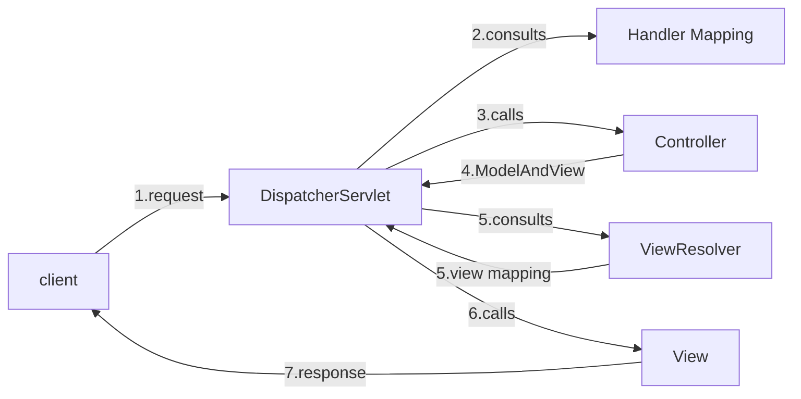

# Homework 10 — Spring MVC
**Author: M. Yang**

## Question 1
> Spring Boot Annotations Review

See [Spring-Boot-Annotations.md](Spring-Boot-Annotations.md).

## Question 2
> Loose Coupling vs. Tight Coupling
> 
> How does Spring IoC relate to this?

◾ **Tight coupling** occurs when components are **highly dependent** on each other’s internal details.
A change in one module often requires changes in the other.

◾ **Loose coupling** refers to a design where components are **mostly independent**.
They interact through well-defined interfaces or abstractions, minimizing the knowledge of each other's internal workings.

Spring IoC is fundamentally designed to promote loose coupling between components.
See [Spring-Boot-Annotations.md]((Spring-Boot-Annotations.md#spring-container)) for more details.


## Question 3
> The MVC (Model-View-Controller) Pattern.

The MVC pattern is a software architectural design that separates an application into three interconnected parts,
promoting **separation of concerns**.
- **Model:** represents the **data** and **business logic** of the application.
- **View:** represents the **presentation layer** that displays the data from the model to the user.
- **Controller:** an intermediary between the model and the view to **handle user input**, **updates the model**, and **determines which view** to display.


## Question 4
> What is a **front controller**?

A front controller is a **design pattern** in which
a single **central controller** handles all incoming requests for a web application **before dispatching** them to appropriate handlers (controllers or actions).


## Question 5
> `DispatcherServlet`

`DispatcherServlet` is the central [**front controller**](#question-4) in Spring MVC that **receives all incoming HTTP requests**,
**dispatches** them to appropriate controllers, and manages the overall **request-to-response** workflow.



1. **Receives the Request**:
    - All incoming requests matching a certain URL pattern (often `/`) are directed to the `DispatcherServlet`.

2. **Request Handling**:
    - The `DispatcherServlet` **consults Handler Mapping** to find the appropriate controller (e.g., a `@Controller` class with a method mapped to the URL).

3. **Calls the Controller**:
    - It forwards the request to the selected controller method to process business logic.

4. **Receives a ModelAndView**:
    - The controller returns a [`ModelAndView`](#question-6) object (which contains the **model** and the **logical view name**).

5. **Resolves the View**:
    - `DispatcherServlet` uses a **View Resolver** to **map** the logical view name to an **actual view** (such as a [JSP](#question-6) page, Thymeleaf template, etc.).

6. **Renders the Response**:
    - The resolved view is rendered with the provided model data, and the response is sent back to the client.


## Question 6
> JSP (JavaServer Pages)
>
> `ModelAndView`

JSP is a Java-based technology used to create dynamic web pages by **embedding Java code directly into HTML** pages.

`ModelAndView` is a Spring MVC **class** used to represent **the model (data)** and the view (**the view name or the view object**) that are [**returned from a controller**](#question-5) after processing a request.


## Question 7
> - Servlet
> - Servlet Container

### Servlet
A **Java-based server-side** component that **handles requests** and **generates dynamic responses** in a web application,
typically running within a web server or servlet container like **Apache Tomcat** or **Jetty**.

### Servlet Container
A servlet container (or web container) is a **component of a web server** or a stand-alone environment that **manages the lifecycle of servlets**, **maps requests to servlets**, and **handles HTTP communication**.

**Common Servlet Containers**
- Apache Tomcat
- Jetty
- WildFly (formerly JBoss)
- GlassFish


## Question 8
> Try running Tomcat with [this project](https://github.com/CTYue/springmvc5-demo).
> 1. Set the project SDK to JDK 1.8 (select **Download JDK...** when choosing from IDEA).
> 2. Use [Tomcat 9](https://dlcdn.apache.org/tomcat/tomcat-9/v9.0.100/bin/apache-tomcat-9.0.100.zip)
>   - set up from **Run / Debug Configurations** in IDEA.
>   - choose JDK 1.8 as the JRE.
> 3. Use a MySQL Docker container (create a database named `mvc_demo`).
> 4. Use the Postman request imported by
>   ```
>   curl --location 'http://localhost:8080/springmvc_demo_war/customer/list' \
>   --header 'Accept: */json' \
>   --header 'Cookie: JSESSIONID=DE7980CF6C64A4ADF9AF232D4231C01C'
>   ```
> 5. Test each endpoint of the `CustomerController.java`.

<details>
<summary>Test Results</summary>

### ◆ List All Customers


### ◆ Add a Customer


### ◆ Update a Customer


### ◆ Delete a Customer


</details>
