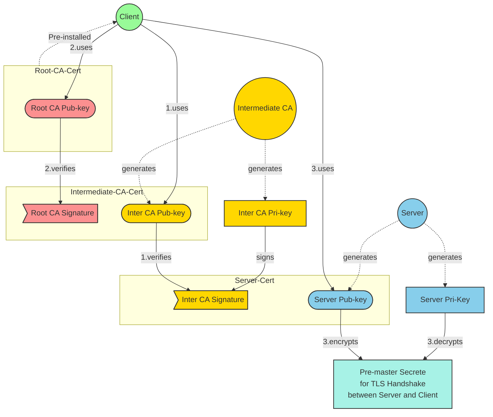

# Homework 11 — Spring Security
**Author: M. Yang**

## Question 1
> Spring Boot Annotations Review

See [Spring-Boot-Annotations.md](Spring-Boot-Annotations.md).

## Question 2
> Explain the concepts below:
> - TLS (Transport Layer Security)
> - PKI (Public Key Infrastructure)
> - Certificate
> - Signature
> - Private Key
> - Public Key

### ◆ TLS
A cryptographic protocol that **secures communication over networks** by providing confidentiality, integrity, and authenticity.
It is widely **used in HTTPS** to secure web traffic.

### ◆ PKI
A system for **managing** public-key encryption and digital **certificates**, enabling secure identity verification and encrypted communication.

### ◆ Signature
A cryptographic value **generated using a private key** to verify the authenticity and integrity of data, **validated with** the corresponding **public key**.

### ◆ Private Key
A **confidential** key used to **decrypt data** encrypted with the public key or to **create digital signatures**.

### ◆ Public Key
A **shared** key used to **encrypt data** or **verify digital signatures** created with the corresponding private key.

### ◆ Certificate
An electronic document that **binds a public key to an entity’s identity** (the subject), **signed** by a trusted Certificate Authority (CA).

#### Certificate Chain

Root CA Certificate

- Contains **Root CA's public** key
- Usually **pre-installed** in clients

Intermediate CA Certificate

- **Issued** by **root CA** (or superior intermediate CA)
- **Signed** by **root CA's private** key
    - A **client** with root CA Certificate uses **root CA's public** key to **verify** the signature
- **Intermediate CA's public** key **attached by the ICA**
- Distributed to a server and **then to a client by a server**

Server Certificate

- **Issued** by **intermediate CA**
- **Signed** by **intermediate CA's private** key
    - A **client** with intermediate CA Certificate uses **intermediate CA's public** key to **verify** the signature
- **Server's public** key **attached by the server**
- Distributed to a client by server

## Question 3
> Create a mini Spring application that supports HTTPS with a self-signed certificate.
> - [Tutorial](https://www.baeldung.com/spring-channel-security-https)
> - Pack the certificate as a `.jks` file.

## Question 4
