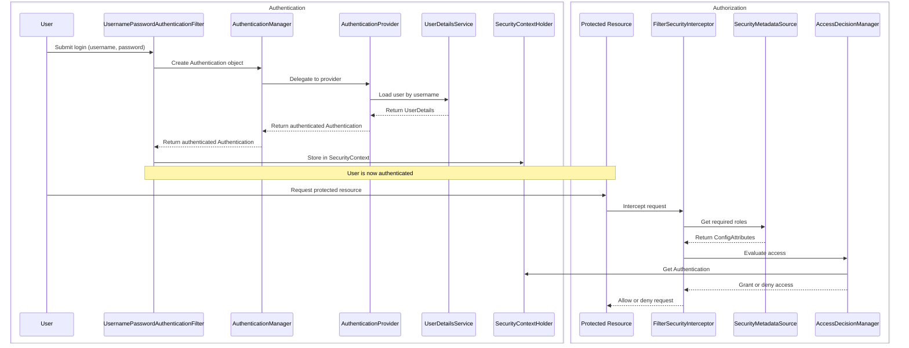
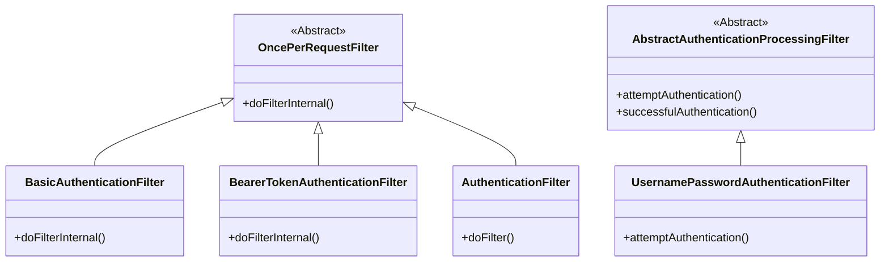

# Homework 11 — Spring Security
**Author: M. Yang**

## Question 1
> Spring Boot Annotations Review

See [Spring-Boot-Annotations.md](Spring-Boot-Annotations.md).

## Question 2
> Explain the concepts below:
> - TLS (Transport Layer Security)
> - PKI (Public Key Infrastructure)
> - Certificate
> - Signature
> - Private Key
> - Public Key

### ◆ TLS
A cryptographic protocol that **secures communication over networks** by providing confidentiality, integrity, and authenticity.
It is widely **used in HTTPS** to secure web traffic.

### ◆ PKI
A system for **managing** public-key encryption and digital **certificates**, enabling secure identity verification and encrypted communication.

#### Key Components
- **Certification Authorities (CAs):** trusted entities that issue digital certificates.
- **Digital certificates:** see [◆ Certificate](#-certificate).
- **Private and public keys:** see [◆ Private Key, ◆ Public Key](#-private-key).
- **Key management:** the processes and procedures for generating, distributing, storing, and revoking digital certificates and keys.

### ◆ Signature
A cryptographic value **generated using a private key** to verify the authenticity and integrity of data, **validated with** the corresponding **public key**.

### ◆ Private Key
A **confidential** key used to **decrypt data** encrypted with the public key or to **create digital signatures**.

### ◆ Public Key
A **shared** key used to **encrypt data** or **verify digital signatures** created with the corresponding private key.

### ◆ Certificate
An electronic document that **binds a public key to an entity’s identity** (the subject), **signed** by a trusted Certificate Authority (CA).

#### Certificate Chain

Root CA Certificate

- Contains **Root CA's public** key
- Usually **pre-installed** in clients

Intermediate CA Certificate

- **Issued** by **root CA** (or superior intermediate CA)
- **Signed** by **root CA's private** key
    - A **client** with root CA Certificate uses **root CA's public** key to **verify** the signature
- **Intermediate CA's public** key **attached by the ICA**
- Distributed to a server and **then to a client by a server**

Server Certificate

- **Issued** by **intermediate CA**
- **Signed** by **intermediate CA's private** key
    - A **client** with intermediate CA Certificate uses **intermediate CA's public** key to **verify** the signature
- **Server's public** key **attached by the server**
- Distributed to a client by server

## Question 3
> Create an API that supports HTTPS with a self-signed certificate.
> - Pack the certificate as a `.jks` file.
>
> **Part 1 — Testing in Postman**
> 
> Postman **doesn't** use the **system's TRUSTED** certificate store.
> Therefore, for **this part**, it doesn't matter whetter the certificate is imported into the system's trusted certificate store.
> - Test the HTTPS connection in Postman **without** importing the certificate into Postman.
>   - SSL certificate verification **must be turned on** in Postman.
> - Test the HTTPS connection in Postman after importing the certificate.
>
> **Part 2 — Testing in Browser**
> 
> Browsers use the **system's TRUSTED** certificate store.
> - Test the HTTPS connection in a browser **without** adding the certificate to the trusted certificate store.
> - Test again after adding the certificate to the **trusted** certificate store.
>   - Installing the certificate to another certificate store of the system won't work.
> For example, the system may ask whether to **automatically** select the certificate store and install to a **non-trusted** store.

Code in [https-demo](../Projects/https-demo).

### Part 1 — Testing in Postman

Results

◾ **SSL certificate verification has been turned on.**

◾ **Postman reports `Error: self signed signature` without certificate imported.**

◾ **HTTPS connection successful after certificate imported.**

◾ **HTTP connections aren't allowed as designed.**

### Part 2 — Testing in Browser

Results

◾ **Browser reports site insecure without certificate in the trusted store.**

◾ **Browser reports no issues with certificate in the trusted store.**

◾ **HTTP connections aren't allowed as designed.**

## Question 4
> HTTPS status codes related to authentication and authorization failures

| **Status Code** | **Name**                        | **Category**   | **Description**                                                              |
|-----------------|---------------------------------|----------------|------------------------------------------------------------------------------|
| 401             | Unauthorized                    | Authentication | The request lacks valid authentication credentials.                          |
| 403             | Forbidden                       | Authorization  | The server understands the request but refuses to authorize it.              |
| 407             | Proxy Authentication Required   | Authentication | The client must authenticate itself with a proxy server.                     |
| 511             | Network Authentication Required | Authentication | The client must authenticate to gain network access (e.g., captive portals). |

## Question 5
> Authentication vs. Authorization
> 
> Spring Security Flow

### Authentication vs. Authorization

| **Aspect**           | **Authentication**                       | **Authorization**             |
|----------------------|------------------------------------------|-------------------------------|
| **Purpose**          | Verifies identity                        | Grants access rights          |
| **Occurs**           | First                                    | Second (after authentication) |
| **Based on**         | Credentials (e.g., password, biometrics) | Permissions and roles         |
| **Determines**       | Who the user is                          | What the user can do          |
| **Example Question** | "Are you who you say you are?"           | "Are you allowed to do this?" |

### Spring Security Flow

| **Component**                            | **Role**                                | **Function**                                                                                  | **Notes / Implementation Details**                                             |
|------------------------------------------|-----------------------------------------|-----------------------------------------------------------------------------------------------|--------------------------------------------------------------------------------|
| **UsernamePasswordAuthenticationFilter** | Processes login requests                | Intercepts login form data and submits credentials to the `AuthenticationManager`             | Typically mapped to `/login`                                                   |
| **AuthenticationManager**                | Central interface for authentication    | Processes an `Authentication` request and returns a fully authenticated object                | Common implementation: `ProviderManager` delegates to `AuthenticationProvider` |
| **AuthenticationProvider**               | Performs authentication logic           | Validates credentials and returns a populated `Authentication` object if successful           | Example: `DaoAuthenticationProvider`                                           |
| **UserDetailsService**                   | Loads user-specific data                | Returns a `UserDetails` object by username                                                    | Often customized to query users from a database                                |
| **UserDetails**                          | Encapsulates user information           | Contains username, password, roles, and account status                                        | Used by `AuthenticationProvider` to verify identity                            |
| **GrantedAuthority**                     | Represents a permission or role         | Defines user access levels; checked during authorization                                      | Part of the `Authentication` object                                            |
| **SecurityContext**                      | Holds authentication data               | Stores the `Authentication` object for a specific execution context                           | Retrieved from or set into `SecurityContextHolder`                             |
| **SecurityContextHolder**                | Manages thread-local security context   | Provides access to the current thread’s `SecurityContext`                                     | Key entry point for retrieving the authenticated principal                     |
| **FilterSecurityInterceptor**            | Enforces access control on web requests | Final filter in the chain that evaluates authorization based on metadata and decision manager | Relies on `SecurityMetadataSource` and `AccessDecisionManager`                 |
| **SecurityMetadataSource**               | Provides required access metadata       | Supplies `ConfigAttributes` (e.g., required roles) for secured resources                      | Used for both URL- and method-based security                                   |
| **AccessDecisionManager**                | Makes authorization decisions           | Evaluates access based on `Authentication` and `ConfigAttribute`                              | Used by `FilterSecurityInterceptor` or `MethodSecurityInterceptor`             |

## Question 6
> Explain HTTP Session.

An HTTP session is a mechanism that enables a server to **retain user-specific data across multiple HTTP requests**, despite **HTTP being inherently stateless**.
It uses a unique session ID (typically stored in a Cookie) to maintain continuity, allowing data such as **authentication** or **preferences** to persist during a user's interaction with a web application.

## Question 7
> Explain Cookie.

A cookie is a small piece of data **stored on a user's device by a website through the web browser**,
commonly used to remember information **between** browsing **sessions** and enable a more **personalized** and efficient user experience.

| **Category** | **Type of Cookie** | **Description**                                                          | **Lifespan**                    | **Common Uses**                                         |
|--------------|--------------------|--------------------------------------------------------------------------|---------------------------------|---------------------------------------------------------|
| **Duration** | Session Cookie     | Stores session data                                                      | **Until** browser is **closed** | **Shopping carts**, session management                  |
|              | Persistent Cookie  | Stores persistent data                                                   | Defined by **expiry date**      | **Login preferences**, language selection               |
| **Origin**   | First-Party Cookie | Created by the website being visited.                                    | Session or persistent           | **Site settings**, analytics by the same domain         |
|              | Third-Party Cookie | Created by domains other than the one being visited (e.g., ad networks). | Session or persistent           | **Cross-site tracking**, advertising, social media tags |
| **Security** | Secure Cookie      | Only transmitted over **HTTPS** connections.                             | Session or persistent           | Secure login and data transmission                      |
|              | HttpOnly Cookie    | Not accessible via JavaScript; reduces **XSS** risk.                     | Session or persistent           | Authentication tokens                                   |
|              | SameSite Cookie    | Controls whether the cookie is sent with cross-site requests.            | Session or persistent           | Prevents **CSRF** attacks                               |

## Question 8
> Session vs. Cookie

- A session stores and manages user-specific **session data** on the **server**,
and a cookie stores a **session ID** on the **client**.
- A cookie allows a server to link its session data to a specific user,
enabling **stateful** behavior.

## Question 9
> Log in to two websites that support Google SSO using Google Account.
> 
> In the browser's developer tool, look for **OAuth redirect** requests (status: `302 Found`).
> 
> Explain how Google SSO works with **observations** from the requests.

## Observations

Docker Hub

Postman

1. Each website has an OAuth-related redirect request with status code `302`.
2. Each request shares something in common in Request Headers:
   - `:authority: accounts.google.com`
   - `:method: GET`
   - `:path:` contains the keyword `oauth`
   - `Cookie:` exact the same
3. Each website also made a call back request, where the `Request URL`
matches the `Response Headers`'s `Location:` field of the redirect request.

## How Google SSO Works

1. **OAuth Flow Initiation**:  
When using Google SSO, the browser makes a redirect request (`302` status) to Google's authorization server (`accounts.google.com`). Key request headers:
   - `:authority: accounts.google.com`: Targets the OAuth server.
   - `:method: GET`: Initiates the OAuth flow.
   - `:path: contains oauth`: Indicates OAuth process.
   - `Cookie`: Identifies the user via active session, enabling seamless login.

2. **User Authorization**:  
The user is prompted to approve permissions. If granted, Google generates an **authorization code**.

3. **Redirect Back to Website**:  
After permission, Google redirects to the website’s callback URL with the **authorization code** in the `Location:` header in the response. The callback request uses this code to exchange for an access token.

4. **Access Token Exchange**:  
The website exchanges the **authorization code** at Google's OAuth token endpoint for an access token, enabling access to Google services tied to the SSO.

## Question 10
> How to keep user information across an application using session and cookie.

See [Question 8](#question-8).

## Question 11
> Spring Security Filter

In Spring Security, a security filter is a component in the **servlet filter chain** that **intercepts HTTP** requests and responses to enforce security measures such as **authentication**, **authorization**, and **session management**.

Spring Security uses a delegating filter mechanism, where a single filter called `DelegatingFilterProxy` is registered with the servlet container. This proxy delegates actual security work to a Spring-managed bean named `springSecurityFilterChain`, which is a **chain of filters**.

Common Filters in the Chain

**The order** in which they are invoked is crucial for proper functioning.

1. `SecurityContextPersistenceFilter`
   - Manages the lifecycle of the `SecurityContext`.
   - Loads security context at the beginning and stores it at the end of each request.

2. `UsernamePasswordAuthenticationFilter`
   - Handles form-based login using username and password.
   - Typically processes requests at `/login`.

3. `BasicAuthenticationFilter`
   - Processes HTTP Basic authentication headers.

4. `BearerTokenAuthenticationFilter`
   - Validates Bearer tokens, typically used with OAuth2/JWT authentication.

5. `ExceptionTranslationFilter`
   Translates Spring Security exceptions to HTTP responses. (e.g., 401 Unauthorized, 403 Forbidden).

6. `FilterSecurityInterceptor`
   - Performs access control decisions using configured security metadata (e.g., roles, permissions).

7. `CsrfFilter`
   - Provides protection against Cross-Site Request Forgery (CSRF) attacks.

## Question 12
> Bearer Token
> 
> JWT (Json Web Token)

## Question 13
> How to store sensitive user information (e.g., password, credit card number) in a database.

## Question 14
> Compare the following:
> - `AuthenticationFilter`
> - `AuthenticationManager`
> - `AuthenticationProvider`
> - `UserDetailsService`

`AuthenticationFilter` **was a general concept** representing authentication-related filters before becoming a specific **class in Spring Security 6**,
used for declarative authentication flows such as bearer token processing.

See [Question 11](#question-11) for Spring Security filters.

See [Question 5](#question-5) for Spring Security flow that involves
`AuthenticationManager`, `AuthenticationProvider`, `UserDetailsService`.

## Question 15
