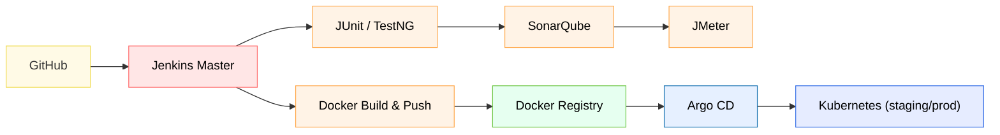

# Homework 12 — Testing
**Author: M. Yang**

<details>
<summary>Table of Contents</summary>

1. [Testing Types](#testing-related)
2. [Software Development Environments](#environment-related)
3. [Sprint Routine](#question-3)
4. [SLA vs. SLO](#question-4)
5. [JMeter Performance Testing](#question-5)
6. [TestNG](#question-6)
7. [CI/CD Pipeline](#question-7)

</details>

## Question 1
> Explain the concepts below.
> 
> **Testing Related**
> 1. Unit Testing ◇
> 2. Integration Testing ◆
> 3. Functional Testing ◆
> 4. Regression Testing ◆
> 5. Smoke Testing ◆
> 6. Performance Testing ◈
> 7. Stress Testing ◈
> 8. A/B Testing ◆
> 9. End-to-End Testing ◆
> 10. User Acceptance Testing (UAT) ◆
>
> ◇: White box testing
> ◆: Black box testing
> ◈: Treated as black box testing but may involve white box testing
> 
> **Environment Related**
> 1. Development
> 2. QA (Quality Assurance)
> 3. Pre-Prod/Staging
> 4. Production

### Testing Related

| Test Type           | Keywords                      |
|---------------------|-------------------------------|
| **Unit**            | method, class                 |
| **Integration**     | module interactions           |
| **Functional**      | functional requirements       |
| **Regression**      | code change, rerun            |
| **Smoke Test**      | broad, shallow                |
| **Performance**     | expected workload             |
| **Stress**          | overload                      |
| **End to End**      | QA, system, functionality     |
| **User Acceptance** | system, business requirements |

#### Unit Testing
- Testing **individual** components (usually **methods** or **classes**) in isolation.
- **Frameworks**: JUnit, Mockito, TestNG
- **Example**:
    ```java
    @SpringBootTest
    class CalculatorServiceTest {
    
        @Autowired
        private CalculatorService calculatorService;
    
        @Test
        void testAddition() {
            assertEquals(5, calculatorService.add(2, 3));
        }
    }
    ```

#### Integration Testing
- Testing the interaction **between multiple** components or modules.
- **Frameworks**: TestNG
- **Example**:

  A unit test isolates the `@Service` by mocking its repository to check only service logic,
  while an integration test runs the real `@Service` and `@Repository` together against a test database (e.g., H2) to verify their interaction.
    ```java
    @SpringBootTest
    @AutoConfigureTestDatabase
    class UserRepositoryIntegrationTest {
    
        @Autowired
        private UserRepository userRepository;
    
        @Test
        void testSaveAndRetrieveUser() {
            User user = new User("John", "Doe");
            userRepository.save(user);
    
            Optional<User> found = userRepository.findById(user.getId());
            assertTrue(found.isPresent());
        }
    }
    ```

#### Functional Testing
- Tests the **system** against **functional requirements**, focusing on what the system does.

- **Example**: Using Postman to test the REST API endpoints of a Spring Boot app.

#### Regression Testing
- **Re-run previously run tests** to verify that **new code** changes have not adversely affected existing functionalities.

- **Example**: After modifying a login method, **rerun** the full suite of tests to ensure login and other features are still functional.

#### Smoke Testing
- A.k.a., **build verification test**.
A **preliminary** (broad but shallow) test that checks the basic functionality of an application to determine whether it is stable enough for further testing.
Often part of the **CI/CD** pipeline.

- **Frameworks**: JUnit / TestNG (backend), Selenium (browser automation), Postman (API), Jenkins / GitHub Actions (CI)
- **Example**: After deploying the Spring Boot application in the CI pipeline, run a smoke test that sends a `GET` request to `/actuator/health` and expects an HTTP 200 response to confirm the app is up and responsive.

#### [Performance Testing](#question-4)
- Measures how a system behaves under **expected workloads**.
- **Frameworks**: JMeter, k6, Gatling
- **Example**: Using JMeter to simulate 100 **concurrent users** accessing `/api/products`.

#### Stress Testing
- A **form of performance testing** that evaluates system behavior under **extreme conditions**.
- **Frameworks**: JMeter, k6, Gatling
- **Example**: **Continuously increase the request rate** on a Spring Boot API **until it starts returning 5xx errors**.

#### A/B Testing
- A comparative testing method where **two versions** (A and B) of a webpage or feature are **shown** to different user groups to determine which performs better based on **specific metrics**.

- **Example**: Route 50% of users to `/homepageA` and 50% to `/homepageB`, then compare conversion metrics.

#### End-to-End Testing
- Tests the **complete workflow** of an application from **start to finish**.

- **Example**: Automating a user registration flow in a Spring Boot app **from UI interaction to DB verification**.

#### User Acceptance Testing (UAT)
- Validation of system functionality **by the end user or client** to ensure it meets business requirements.

- **Example**: Client tests a Spring Boot-based booking system on the [staging](#pre-prodstaging) environment to approve the feature.


### Environment Related

| Environment              | Purpose                        | Characteristics                                                                                   | Users                          | Data Volumes / Type                      |
|--------------------------|--------------------------------|---------------------------------------------------------------------------------------------------|--------------------------------|------------------------------------------|
| **Development (Dev)**    | Developers write and test code | Frequent changes, may use mocks or local DBs, not stable                                          | Developers                     | Small, synthetic or mock data            |
| **Staging (Stage / QA)** | Pre-production validation      | Mirrors production: same DB type, configuration, services, etc. Stable enough to test deployments | QA team, Devs for final checks | Medium, scrubbed copy of production data |
| **Production (Prod)**    | Live system                    | Handles real users, real data, high availability                                                  | End users                      | Full-scale, real user data               |

#### Development
- Primary environment for active code development.
- Spring Boot: Typically uses `dev` profile.
    ```properties
    spring.profiles.active=dev
    spring.datasource.url=jdbc:h2:mem:testdb
    spring.datasource.driverClassName=org.h2.Driver
    spring.datasource.username=sa
    spring.datasource.password=
    ```

#### QA
- An environment dedicated to **comprehensive testing activities** such as [functional](#functional-testing), [integration](#integration-testing), and [regression testing](#regression-testing).
It simulates real-world scenarios to catch defects **before further deployment**.
- Spring Boot: Might use a `qa` profile for testing.

#### Pre-Prod/Staging
- A **near-replica of the production environment** used for final validation, including [UAT](#user-acceptance-testing-uat) and [performance testing](#performance-testing).
It serves as the last checkpoint before release to production.
- Example: Spring Boot app **connected to** the same type of DB and services as **production**.

#### Production
- Live environment used by actual users.
- Spring Boot: Typically uses `prod` profile with real databases and credentials.
    ```properties
    spring.profiles.active=prod
    spring.datasource.url=jdbc:mysql://prod-db:3306/app
    spring.datasource.username=prod_user
    spring.datasource.password=
    ```


## Question 2
> Write unit tests for [this Java class](https://github.com/CTYue/springboot-redbook/blob/10_testing/src/main/java/com/chuwa/redbook/service/impl/CommentServiceImpl.java).
>
> Cover as many lines/branches as possible.
> 
> Prove code coverage using Jacoco Report.

* Code: [CommentServiceImplTest.java](../Coding/HW12/Question2/CommentServiceImplTest.java)
* Jacoco Report: [CommentServiceImpl.html](../Coding/HW12/Question2/CommentServiceImpl.html)
    


## Question 3
> Sprint Routine

- 1 to 4 weeks (commonly 2 weeks)
- Sprint planning: select tasks and user stories from the backlog (1st day)
- Sprint Review: demo completed work (last day)
- Sprint Retrospective: reflection — discuss what went well and what can improve for the next Sprint (last day)


## Question 4
> SLA (Service-Level Agreement) vs. SLO (Service-Level Objective)

| Aspect / Term   | SLA                                                                                                                     | SLO                                                                                                                     | Relationship                                                                                                      |
|-----------------|-------------------------------------------------------------------------------------------------------------------------|-------------------------------------------------------------------------------------------------------------------------|-------------------------------------------------------------------------------------------------------------------|
| **Definition**  | Formal contract between service provider and customers; defines promised service levels, often with penalties if unmet. | Internal reliability target set by the engineering team; measures service health, not necessarily exposed to customers. | SLOs are **stricter** than SLAs; SLA often derived from one or more SLOs to provide margin for unexpected issues. |
| **Example**     | “Our API will be available 99.9% of the time each month. If uptime falls below this, customers receive a 10% credit.”   | “We aim for 99.95% uptime monthly.”<br>“99% of requests should return within 200ms.”                                    | SLA: 99.9% uptime (customer promise)<br>SLO: 99.95% uptime (internal goal)                                        |
| **Perspective** | **Customer**-facing (business)                                                                                          | **Engineering**-facing (internal)                                                                                       | Both customer & engineering (bridging contract and internal targets)                                              |


## Question 5
> JMeter Performance Testing

JMeter works by **sending requests to REST/HTTP endpoints**.

### Test Types

| **Type**                     | **Description**                                                                   |
|------------------------------|-----------------------------------------------------------------------------------|
| **Load Testing**             | Simulates expected number of users to evaluate system behavior under normal load. |
| **Stress Testing**           | Pushes the system beyond normal limits to identify breaking points.               |
| **Spike Testing**            | Applies sudden increase/decrease in load to test system resilience.               |
| **Endurance (Soak) Testing** | Runs the system for an extended period to detect memory leaks or resource issues. |
| **Scalability Testing**      | Gradually increases load to verify the system’s ability to scale.                 |

### Test Plan Components

| Component            | Purpose                                                                         | Example in a Spring Boot App Test Plan                            |
|----------------------|---------------------------------------------------------------------------------|-------------------------------------------------------------------|
| **Thread Group**     | Defines the number of virtual users, ramp-up time, and loops (user population). | 50 users, ramp-up 30s, each repeats actions 10 times.             |
| **Samplers**         | The actual requests or actions executed by users.                               | `POST /login`, `GET /products`, `POST /checkout`.                 |
| **Parameterization** | Provides dynamic test data so users don’t all send identical requests.          | Load usernames/passwords from CSV file into login requests.       |
| **Correlation**      | Extracts dynamic values (tokens, session IDs) from responses and reuses them.   | Capture JWT from `/login` and add it to the Authorization header. |
| **Timers**           | Adds delays to simulate real user think time and pacing of requests.            | Random delay of 2–5s between browsing and checkout requests.      |

### Metrics

| Metric                      | What It Measures                                                                      | How to Use / Monitor in JMeter & Spring Boot                                                                                     |
|-----------------------------|---------------------------------------------------------------------------------------|----------------------------------------------------------------------------------------------------------------------------------|
| **Response Time / Latency** | Time taken for a single request to complete (from client request to server response). | Measured by JMeter listeners (Summary Report, Aggregate Report); analyze average and percentiles (e.g., 95th / 99th Percentile). |
| **Throughput (QPS / TPS)**  | Number of requests completed per second (QPS) or per transaction per second (TPS).    | Use Throughput column in JMeter reports; combine with Constant Throughput Timer to control load.                                 |
| **Error Rate**              | Percentage of requests that fail (HTTP errors, assertion failures).                   | Use Assertion Results / Summary Report; helps identify stability issues under load.                                              |
| **Concurrency**             | Number of active users (threads) at a given time.                                     | Thread Group configuration; monitor JMeter active threads and server-side session counts.                                        |
| **Resource Utilization**    | Server resource consumption (CPU, memory, DB connections, thread pools).              | Monitor Spring Boot metrics via Actuator / Prometheus / Grafana during load tests.                                               |


## Question 6
> TestNG

TODO


## Question 7
> CI/CD Pipeline



| **Step**                       | **Description**                                                                                                                                                    |
|--------------------------------|--------------------------------------------------------------------------------------------------------------------------------------------------------------------|
| **Code Commit**                | Developers push code to **GitHub**. A **GitHub webhook** notifies Jenkins about the new commit.                                                                    |
| **Build & CI Trigger**         | **Jenkins master** receives the webhook and orchestrates the pipeline. The actual work (compiling, testing, Dockerizing) is performed by **Jenkins agents/nodes**. |
| **Unit & Integration Testing** | Run **JUnit** and **TestNG** tests on Jenkins agents to validate functionality.                                                                                    |
| **Code Quality Analysis**      | **SonarQube** analyzes the code for bugs, vulnerabilities, and code smells.                                                                                        |
| **Performance Testing**        | Execute **JMeter** tests to ensure the application can handle expected load.                                                                                       |
| **Containerization**           | Build a **Docker** image of the Spring Boot application.                                                                                                           |
| **Image Push**                 | Push the Docker image to a **Docker Registry**.                                                                                                                    |
| **Continuous Deployment**      | **Argo CD** monitors the Git repository/manifests and deploys the updated image to **Kubernetes** clusters (staging or production).                                |
