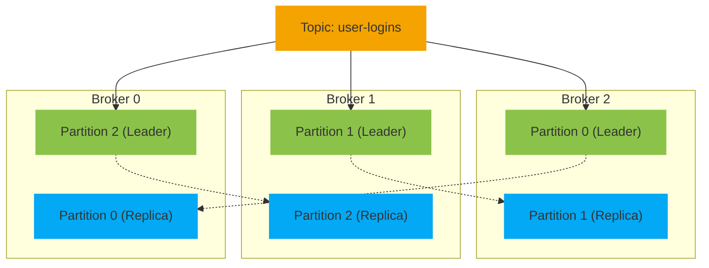

# Homework 14 — Apache Kafka
**Author: M. Yang**

## Question 1
> Explain the following concepts and how they coordinate with each other.
> - Broker
> - ZooKeeper
> - Topic
> - Partition
> - Offset
> - Producer
> - Consumer Group

### ◆ Broker
- A **broker** is a Kafka server that stores data and handles client requests (producing and consuming).
- Each broker can host multiple partitions of different topics.
- Multiple brokers form a Kafka **cluster** for fault tolerance and load balancing.

### ◆ Zookeeper
- **Zookeeper** is used (in older Kafka versions) to coordinate Kafka cluster state and metadata.
- Responsibilities include:
    - Broker discovery
    - Controller election
    - Cluster configuration
- Kafka is transitioning to **KRaft mode** to eliminate the need for Zookeeper.

### ◆ Topic
- A **topic** is a logical channel to which producers send messages and from which consumers read messages.
- It acts like a message queue or feed name.
- Each topic can have multiple **partitions**
- Topics are **append-only** logs (existing messages in the topic are not modified or deleted unless by retention policies).

### ◆ Partition
- A **partition** is a unit of parallelism within a topic.
- Messages in a partition are ordered and identified by a unique **offset**.
- Partitions enable **horizontal scalability** and **parallel processing**.

### ◆ Offset
- An **offset** is a unique identifier for each record within a partition.
- Offsets mark the position of messages and are used by consumers to track progress.
- Consumers can **commit** offsets to remember their last read position.

### ◆ Producer
- A **producer** sends records (messages) to Kafka topics.
- It can choose which partition to write to (e.g., round-robin, based on key).
- Producers are optimized for **high throughput** and can be asynchronous.

### ◆ Consumer Group
- A **consumer group** is a group of consumers working together to consume data from a topic.
- Kafka ensures that each partition is consumed by only **one consumer** in a group.
- Enables **parallel processing** of partitions across consumers.

### How They Work Together

1. **Producers** publish messages to **topics** (which are divided into **partitions**).
2. **Brokers** store partitioned data and serve producer/consumer requests.
3. **Consumers** in a **consumer group** read messages from partitions.
4. **Offsets** help consumers track which messages have been processed.
5. **Zookeeper** (or KRaft in newer versions) manages cluster coordination and metadata.


## Question 2
> Given $P$ partitions and $C$ consumers, what happens when
> 1. $P$ >= $C$
> 2. $P$ < $C$

| Condition | Consumer Usage            | Partition Usage | Parallelism Limit |
|-----------|---------------------------|-----------------|-------------------|
| $P$ ≥ $C$ | All consumers active      | All partitions  | Limited by $C$    |
| $P$ < $C$ | Only $P$ consumers active | All partitions  | Limited by $P$    |


## Question 3
> Broker & Topic in Depth

### Broker Responsibilities with Topics

#### Partition Storage
- Each broker is responsible for storing one or more partitions of a topic.

#### Leader and Follower Roles
- Each partition has a leader broker and optionally one or more follower brokers (for replication).
- **Only** the **leader** handles all **read and write** requests for the partition. Followers replicate data from the leader.

#### Data Replication
- Kafka ensures fault tolerance by replicating partition data across brokers.

#### Client Interaction
- Producers send messages to the topic, which Kafka routes to the appropriate partition.
- Consumers read messages from partitions. Kafka brokers serve the data depending on partition leadership.

### Broker Coordination
Brokers communicate via Apache ZooKeeper (or KRaft mode in newer Kafka versions) to:
- **Elect** leaders for partitions.
- Maintain **metadata** about topics, partitions, and cluster state.

**Example**


※ Topic `user-logins` with 3 partitions and replication factor 2.


## Question 4
> Message Consumption

- In Kafka, consumers **pull** messages from topics rather than messages being pushed to consumers.
- This model provides **flexibility**, as consumers can:
  - Control the rate of consumption.
  - Re-read messages by adjusting offsets.
  - Pause or slow down consumption to handle backpressure.
- Kafka brokers remain stateless regarding consumer state, making the system more scalable and fault-tolerant.


## Question 5
> Exactly Once Processing

- Use exactly once semantics (EOS)
   - For **Kafka-to-external-systems** workflows, enable producer **idempotence** and use **transactional** APIs.
    ```properties
    enable.idempotence=true
    transactional.id=your-transactional-id
    ```
   
    ```java
    // Java code
    producer.initTransactions();
    producer.beginTransaction();
    producer.sendOffsetsToTransaction(offsets, consumer.groupMetadata());
    producer.commitTransaction(); // or abortTransaction() on failure
    ```
   
   - For **Kafka-to-Kafka** workflows, use Kafka Streams.
    ```properties
    processing.guarantee=exactly_once_v2
    ```
   
- Only commit offsets after successful message processing.
    ```properties
    enable.auto.commit=false
    ```
    
    ```java
    consumer.commitSync();
    ```


## Question 6
> What will happen if some consumers in a consumer group are down?
> 
> Will data loss occur? Why?


## Question 7
> What happens if an entire consumer group is down?
> 
> Will data loss occur? Why?


## Question 8
> Consumer Lag


## Question 9
> How Kafka tracks message delivery.


## Question 10
> Why not use a database for messaging.
>
> Kafka vs RabbitMQ


## Question 11
> With [this repository](https://github.com/CTYue/Spring-Producer-Consumer):
> - Set up 3 consumers in a single consumer group.
> - Increase the number of consumers in a single consumer group. Observe what happens.
> - Create multiple consumer groups and set up different numbers of consumers in each group. Observe consumer offsets.
> - Demo different message delivery guarantees in Kafka.
> - Implement a custom partition logic.
