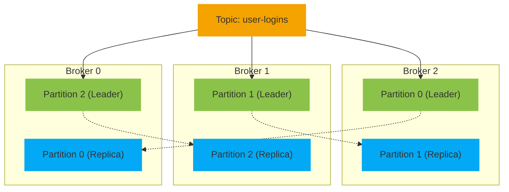
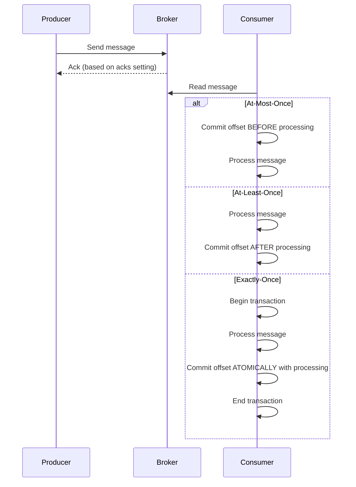

# Homework 14 — Apache Kafka
**Author: M. Yang**

## Question 1
> Explain the following concepts and how they coordinate with each other.
> - Broker
> - ZooKeeper
> - Topic
> - Partition
> - Offset
> - Producer
> - Consumer Group

### ◆ Broker
- A **broker** is a Kafka server that stores data and handles client requests (producing and consuming).
- Each broker can host multiple partitions of different topics.
- Multiple brokers form a Kafka **cluster** for fault tolerance and load balancing.

### ◆ Zookeeper
- **Zookeeper** is used (in older Kafka versions) to coordinate Kafka cluster state and metadata.
- Responsibilities include:
    - Broker discovery
    - Controller election
    - Cluster configuration
- Kafka is transitioning to **KRaft mode** to eliminate the need for Zookeeper.

### ◆ Topic
- A **topic** is a logical channel to which producers send messages and from which consumers read messages.
- It acts like a message queue or feed name.
- Each topic can have multiple **partitions**
- Topics are **append-only** logs (existing messages in the topic are not modified or deleted unless by retention policies).

### ◆ Partition
- A **partition** is a unit of parallelism within a topic.
- Messages in a partition are ordered and identified by a unique **offset**.
- Partitions enable **horizontal scalability** and **parallel processing**.
- The **partition key** is **user-defined** and used by the **producer** to ensure messages with the same key are consistently routed to the same partition.

### ◆ Offset
- An **offset** is a unique identifier for each record within a partition.
- Offsets mark the position of messages and are used by consumers to track progress.
- Consumers can **commit** offsets to remember their last read position.

### ◆ Producer
- A **producer** sends records (messages) to Kafka topics.
- It can choose which partition to write to (e.g., round-robin, based on key).
- Producers are optimized for **high throughput** and can be asynchronous.

### ◆ Consumer Group
- A **consumer group** is a set of consumers identified by a `group.id` that work together to consume data from topics.
- **Separates different applications** processing the same stream.
- Kafka ensures that each partition is consumed by only **one consumer** in a group.
- Enables **parallel processing** of partitions across consumers.

### How They Work Together

1. **Producers** publish messages to **topics** (which are divided into **partitions**).
2. **Brokers** store partitioned data and serve producer/consumer requests.
3. **Consumers** in a **consumer group** read messages from partitions.
4. **Offsets** help consumers track which messages have been processed.
5. **Zookeeper** (or KRaft in newer versions) manages cluster coordination and metadata.


## Question 2
> Given $P$ partitions and $C$ consumers, what happens when
> 1. $P$ >= $C$
> 2. $P$ < $C$

| Condition | Consumer Usage            | Partition Usage | Parallelism Limit |
|-----------|---------------------------|-----------------|-------------------|
| $P$ ≥ $C$ | All consumers active      | All partitions  | Limited by $C$    |
| $P$ < $C$ | Only $P$ consumers active | All partitions  | Limited by $P$    |


## Question 3
> Broker & Topic in Depth

### Broker Responsibilities with Topics

#### Partition Storage
- Each broker is responsible for storing one or more partitions of a topic.

#### Leader and Follower Roles
- Each partition has a leader broker and optionally one or more follower brokers (for replication).
- **Only** the **leader** handles all **read and write** requests for the partition. Followers replicate data from the leader.

#### Data Replication
- Kafka ensures fault tolerance by replicating partition data across brokers.

| **Concept**                | **Definition**                                                                                   | **Purpose**                                                                                 | **Example**                                                                                                    | **Configured By**                 |
|----------------------------|--------------------------------------------------------------------------------------------------|---------------------------------------------------------------------------------------------|----------------------------------------------------------------------------------------------------------------|-----------------------------------|
| `replication.factor`       | **Total** number of replicas (copies) of each partition across brokers.                          | Provides fault tolerance; more replicas → higher durability.                                | `replication.factor=3` → 1 leader + 2 followers.                                                               | User (at topic creation)          |
| **ISR** (In-Sync Replicas) | Replicas that are **fully caught up** with the leader.                                           | Only ISR members can ack writes for `acks=all`.                                             | If one follower lags, ISR may be `{leader, follower1}`.                                                        | Kafka (dynamic)                   |
| `min.insync.replicas`      | Minimum number of replicas (including leader) that **must ack** a write when `acks=all` is used. | Prevents data loss by rejecting writes if **too few** replicas (risk: **acked then fail**). | With 3 replicas and `min.insync.replicas=2`, if only 1 is in sync, write fails (`NotEnoughReplicasException`). | User (topic-level, default = `1`) |

`replication.factor` ≥ ISR size ≥ `min.insync.replicas`

#### Client Interaction
- Producers send messages to the topic, which Kafka routes to the appropriate partition.
- Consumers read messages from partitions. Kafka brokers serve the data depending on partition leadership.

### Broker Coordination
Brokers communicate via Apache ZooKeeper (or KRaft mode in newer Kafka versions) to:
- **Elect** leaders for partitions.
- Maintain **metadata** about topics, partitions, and cluster state.

**Example**


※ Topic `user-logins` with 3 partitions and replication factor 2.


## Question 4
> Message Consumption

- In Kafka, consumers **pull** messages from topics rather than messages being pushed to consumers.
- This model provides **flexibility**, as consumers can:
  - Control the rate of consumption.
  - Re-read messages by adjusting offsets.
  - Pause or slow down consumption to handle backpressure.
- Kafka brokers remain stateless regarding consumer state, making the system more scalable and fault-tolerant.


## Question 5
> Producer Configurations
> - `enable.idempotence=true`
> - `acks`

### Idempotence

- **Producer** sends:
  - **unique producer ID** (PID)
  - monotonically increasing **sequence number**
  - record (content)
- **Broker** checks sequence numbers against the last accepted number for that **PID+partition**:
  - If duplicate → discard
  - If gap → detect loss
  - If next-in-line → accept and assign a fresh offset

<details>
<summary>Example</summary>

Producer sends:
```
PID = 47
Key = 2                # user-defined key for partitioning
Sequence # = 0         # producer’s message sequence per partition
Record = {"user": "u1", "action": "login"}
```

Broker receives:
```
PID = 47
Partition = 0          # resolved partition via partitioner (e.g., key % number_of_partitions)
Sequence # = 0
Record = {"user": "u1", "action": "login"}
```

Log entry looks like:
```
Offset=1000, PID=47, Seq=0, Value={"user":"u1", "action":"login"}
```

Next log entry looks like:
```
Offset=1001, PID=47, Seq=1, Value={"user":"u2", "action":"logout"}
```
</details>

### Acknowledgement Level

| **`acks` Value** | **Meaning**                                                        | **Durability** | **Data Loss**                                                                                                                                               | Data Duplication                                        |
|------------------|--------------------------------------------------------------------|----------------|-------------------------------------------------------------------------------------------------------------------------------------------------------------|---------------------------------------------------------|
| `0`              | Producer does **not wait** for any acknowledgment from the broker. | **Lowest**     | Producer cannot detect failures; messages may be **lost if broker fails immediately**.                                                                      | Effectively **impossible** at the Kafka level           |
| `1`              | Producer waits for **leader** replica to acknowledge.              | **Moderate**   | Message is written to leader but may be **lost if leader fails before followers replicate**.                                                                | **Possible** due to retries                             |
| `all` / `-1`     | Producer waits for **all in-sync replicas (ISR)** to acknowledge.  | **Highest**    | Writes rejected if not enough replicas are in-sync (avoids silent loss). **Data loss can still occur** if all replicas fail or via unclean leader election. | **Possible** if retries with `enable.idempotence=false` |

#### Data Loss while `acks=all`
- **All Replicas Fail:** Hardware loss, disk corruption, etc.
- **Unclean Leader Election:** If no ISR members are available upon leader failure, and unclean leader election is enabled (`unclean.leader.election.enable=true`), Kafka may promote an out-of-sync replica as the new leader.

#### Retry
Triggered only on **detectable** errors, for example
- `TimeoutException`: happens when `delivery.timeout.ms` is exceeded, but how quickly that happens depends on how long each `request.timeout.ms` lasts and how many retries are configured.
- `NotEnoughReplicasException`: see [data replication](#data-replication).

## Question 6
> What will happen if some consumers in a consumer group are down?
> 
> Will data loss occur? Why?

In this case, typically no data loss occurs.

- **Message Retention:** Messages in Kafka are retained for a configurable period, ensuring availability even when consumers are down.
- **Rebalancing:** When a consumer fails, Kafka reassigns its partitions to other active consumers in the group, maintaining uninterrupted consumption.
- **Consumer Offset Tracking:** Kafka tracks the last processed message's offset for each consumer, allowing recovery and preventing data loss if a consumer fails.


## Question 7
> What happens if an entire consumer group is down?
> 
> Will data loss occur? Why?

In this case, data loss may occur.

- **Expired data:** If the consumer group is down for too long, the retention window may expire, leading to potential data loss if messages are deleted from Kafka before being consumed.
- **Effect on Offsets:** Kafka preserves offsets for a downed consumer group, allowing it to resume from the last committed offset upon recovery. However, if unconsumed messages are purged due to retention expiration, **data gaps** may occur.


## Question 8
> Consumer Lag & Solutions

Consumer lag is the difference between the offset of the **last message produced to a partition** and the offset of the **last message consumed by the consumer**.

### Causes of Consumer Lag
- **Slow Consumer:** The consumer application processes messages slowly due to **inefficient processing logic**, **heavy load**, or **resource constraints** (e.g., CPU, memory).
- **Consumer Group Rebalancing:** When a consumer group undergoes rebalancing, it can temporarily stop consuming messages, causing lag.
- **Network Issues:** Poor network performance can delay the consumption of messages, leading to lag.

### Solutions
- **Scale Consumers**
  - **Increase the number of consumers** in the group (up to the number of partitions)
  - **Scale vertically** by giving consumers more resources (CPU, memory)


- **Optimize Consumer Performance**
  - **Batch processing**: Process messages in batches rather than one at a time
  - **Parallel processing**: Use multi-threading within consumers
  - **Optimize processing logic**: Reduce CPU-intensive operations


- **Tune Configuration**
  - Increase `fetch.min.bytes` and `fetch.max.wait.ms` to get larger batches
  - Adjust `max.poll.records` to control how many records are returned in each poll
  - Increase `session.timeout.ms` and `heartbeat.interval.ms` if rebalances are frequent


- **Partition Management**
  - **Add more partitions** to allow for greater parallelism (requires care)
  - Ensure **even distribution** of messages across partitions


- **Handle Backpressure**
  - Implement **circuit breakers** to slow down producers if needed
  - Use **dead letter queues** for messages that repeatedly fail processing


- **Monitor Consumer Lag**
  - Use monitoring tools like Kafka's JMX metrics, or tools such as Confluent Control Center, Prometheus, Kafka Manager
  - Set up alerts when consumer lag exceeds a threshold, allowing proactive resolution before it impacts system performance


## Question 9
> Delivery Guarantees



| Guarantee         | Commit Timing                               | Data Loss | Data Duplication | Producer Configs                                                      |
|-------------------|---------------------------------------------|-----------|------------------|-----------------------------------------------------------------------|
| **At-most-once**  | Commit → process                            | Possible  | No               | any ack setting (often `acks=0`) & commit before processing           |
| **At-least-once** | Process → commit                            | No        | Possible         | `acks=1` (default) or `acks=all` **with retries > 0**                 |
| **Exactly-once**  | Transactional (process + commit atomically) | No        | No               | `acks=all` & `enable.idempotence=true` **and transactional producer** |

<details>
<summary>Examples</summary>

**At-Most-Once → Data Loss**

| Offset | Action  | Commit         | Process | Consumer Crash | Result                           |
|--------|---------|----------------|---------|----------------|----------------------------------|
| 101    | Fetched | Before process | **No**  | Yes            | Message **lost** (not processed) |
| 102    | Fetched | –              | Yes     | –              | -                                |

**At-Least-Once → Data Duplication**

| Offset | Action                | Commit | Process       | Consumer Crash | Result                                              |
|--------|-----------------------|--------|---------------|----------------|-----------------------------------------------------|
| 101    | Fetched               | **No** | Before commit | Yes            | Message **re-read and processed again** → duplicate |
| 101    | Fetched after restart | –      | **Again**     | –              | Duplicate occurs                                    |
| 102    | Fetched               | –      | Yes           | –              | -                                                   |

**Exactly-Once → No Data Loss, No Duplicates**

| Offset | Action                | Commit                | Process | Consumer Crash         | Result                                                                                                   |
|--------|-----------------------|-----------------------|---------|------------------------|----------------------------------------------------------------------------------------------------------|
| 101    | Fetched               | **No**                | Started | **During transaction** | Transaction **aborted** → message will be reprocessed cleanly after restart → **no duplicates, no loss** |
| 101    | Fetched after restart | Transaction committed | Yes     | –                      | Processed exactly once                                                                                   |
| 102    | Fetched               | Transaction committed | Yes     | –                      | Processed exactly once                                                                                   |


</details>

## Question 10
> Messaging Frameworks vs. Database (for Streaming)
>
> Kafka vs RabbitMQ

### Messaging Frameworks vs. Database (for Streaming)

| **Feature**                  | **Messaging Framework (Kafka, RabbitMQ, etc.)**       | **Relational Database (MySQL, etc.)**                               |
|------------------------------|-------------------------------------------------------|---------------------------------------------------------------------|
| **Throughput**               | High (optimized for large volumes of messages)        | Moderate to Low (not optimized for frequent writes/reads)           |
| **Latency**                  | Low (real-time or near real-time delivery)            | Higher (due to transaction and indexing overhead)                   |
| **Message Ordering**         | Guaranteed (with partitions or queues)                | Must be implemented manually (using timestamps or sequence numbers) |
| **Scalability**              | Horizontal (partitioned topics, consumers)            | Vertical or limited horizontal (sharding required)                  |
| **Concurrency Support**      | Built-in support for multiple producers/consumers     | Possible, but can lead to contention and locking issues             |
| **Message Acknowledgment**   | Built-in (ACK/NACK, retries, dead-letter queues)      | Manual implementation required                                      |
| **Durability Options**       | Configurable (in-memory, disk-based, replicated logs) | Durable storage by default                                          |
| **Retry Mechanism**          | Automatic retries with back-off, DLQs                 | Manual implementation needed                                        |
| **Message TTL / Expiration** | Native support                                        | Requires manual logic (e.g., cron job + timestamp column)           |
| **Backpressure Handling**    | Built-in support                                      | Must be manually managed                                            |

### Kafka vs. RabbitMQ

| Feature           | **Kafka**                              | **RabbitMQ**                             |
|-------------------|----------------------------------------|------------------------------------------|
| Model             | Log-based                              | Queue-based                              |
| Message Retention | Persistent (configurable), Re-readable | Deleted after consumption                |
| Throughput        | Very high                              | Moderate to high                         |
| Latency           | Low (optimized for throughput)         | Low (optimized for responsiveness)       |
| Scalability       | Excellent (partitioned, distributed)   | Good (clustered, but less flexible)      |
| Protocol          | Kafka protocol                         | AMQP (also STOMP, MQTT, etc.)            |
| Message Ordering  | Within partition                       | Within queue                             |
| Setup Complexity  | Higher (Kafka + ZooKeeper/KRaft)       | Lower (standalone or clustered)          |
| Use Cases         | Event streaming, analytics, logging    | Task queues, RPC, microservice messaging |


## Question 11
> With [this repository](https://github.com/CTYue/Spring-Producer-Consumer):
> 1. Set up 3 consumers in a single consumer group and send a message from Postman.
> 2. Increase the number of consumers in a single consumer group. Observe what happens.
> 3. Create multiple consumer groups and set up different numbers of consumers in each group. Observe consumer offsets.
> 4. Demo different message delivery guarantees in Kafka.
> 5. Implement a custom partition logic.

Code: [kafka-demo](../Projects/kafka-demo).

### 1. Three Consumers in a Group

<details>
<summary>Screenshots</summary>

- **Active Consumers**
  
    
    

- **Message Consumption**
  
    
    
    

</details>


### 2. Five Consumers in a Group

<details>
<summary>Screenshots</summary>

- **Only 3** consumers out of 5 are **active**.

  
  

</details>


### 3. Two Consumer Groups
- `consumer_group_1` has 4 consumers
- `consumer_group_2` has 2 consumers

<details>
<summary>Screenshots</summary>

- **Active Consumer Groups**

  
  

  
  

- **Message Consumption**

  
  
  

</details>


### 4. Different Message Delivery Guarantees

<details>
<summary>Screenshots</summary>

- **At Least Once**

  
  

- **At Most Once**

  
  

- **Exactly Once**

  
  

</details>


### 5. Partition Logic

<details>
<summary>Screenshots</summary>

**Custom** Partition Logic
- For **numeric** keys: Use modulo partitioning (key `%` num_partitions)
- For **non-numeric** keys: Use Kafka's `murmur2` **hash** partitioning


</details>
