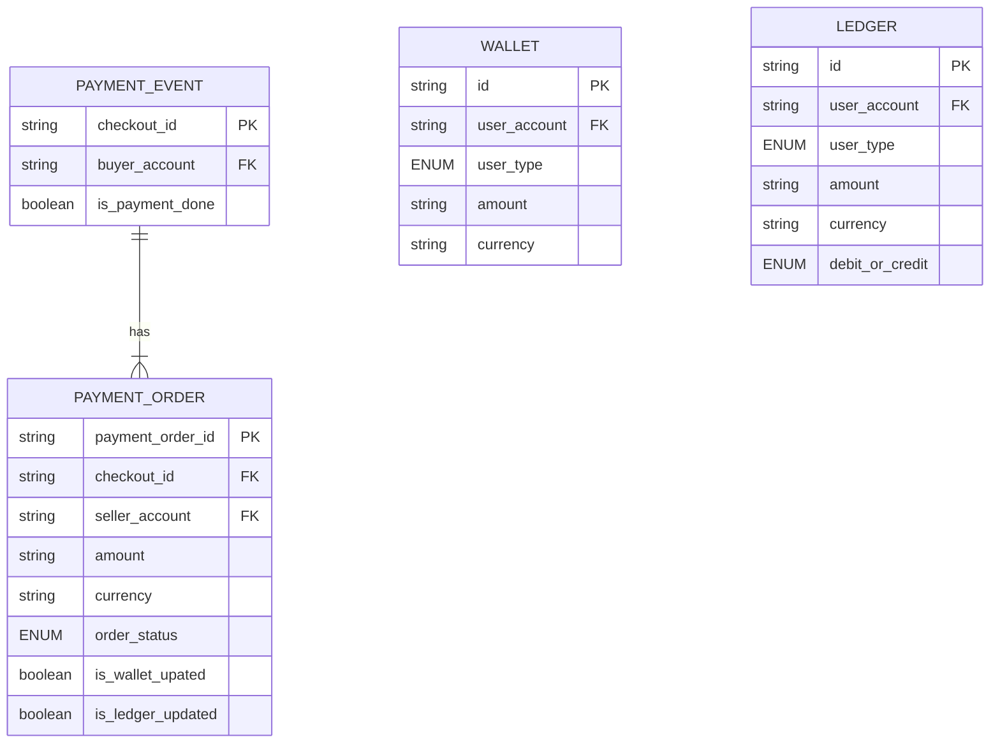

# Homework 18 — System Design Demo
**Author: M. Yang**

## Constraints/Assumptions
1. Only credit card as the payment option.
2. Payment is processed by a payment service provider (PSP) to comply with PCI DSS.
3. The application is used globally.
4. Only one currency is supported.
5. 1 million daily active users (DAU). Peak load is 5 times the average.

## Functional Requirements
### 1. Pay-in flow
Payment system receives money from customers on behalf of sellers.

### 2. Pay-out flow
Payment system sends money to sellers.

TODO: FR Diagram

## Non-functional Requirements
### 1. Highly responsive
- A customer doesn't need to wait long on the payment page.

### 2. Reliability
- Failed payment requests need to be handled carefully.
- No double charge for any payment.

### 3. Consistency
- Internal consistency (e.g., payment service and accounting services).
- **Reconciliation** between the ledger system and PSP.

## Back-of-the-Envelope Estimation

- **Average QPS:** $\frac{1000000 }{24 \cdot 60 \cdot 60 } \approx 10 $
- **Peak QPS:** $5 \cdot 10 = 50$

## Architecture

TODO: Architectural Diagram

### Database
- We may use CockroachDB, Cloud Spanner, or YugabyteDB for a **globally distributed ACID** database.

### Message Queue
We use an Apache Kafka cluster with these **topics**: business (normal), retry, and DLQ.
  - The retry queue may use an incremental interval
  (or exponential backoff under network issue that can't be resolved in a short amount of time).

### Reconciliation
Every night the PSP sends a settlement file to the reconciliation service.
  - The finance team will investigate mismatches found during reconciliation.

### Card Schemes
Card schemes are the organizations that process credit card operations (e.g., Visa, MasterCard, etc.).

## API Design
### ◆ `POST /v1/payments`
This endpoint executes a payment **event**,
which may contain **multiple** payment **orders**.

#### ◾ HTTP Header

`Idempotency-Key: {{UUID}}`

#### ◾ Request Body

| Field                  | Type     | Description                   |
|------------------------|----------|-------------------------------|
| `checkout_id`          | String   | **UUID** for the checkout     |
| `buyer_info`           | JSON     | Buyer-related information     |
| `credit_card_info`     | JSON     | Credit card-related data      |
| `payment_orders`       | **List** | List of payment **orders**    |
| └── `payment_order_id` | String   | **UUID** of the payment order |
| └── `seller_account`   | String   | Seller’s account identifier   |
| └── `amount`           | String   | Payment amount                |
| └── `currency`         | String   | Currency code (e.g., USD)     |

### ◆ `GET /v1/payments/{:id}`
This endpoint returns the execution **status** of a single payment **order**.

## Schema Design

### Payment Event

`checkout_id` is a **UUID** as an idempotency key to ensure the payment **service** handles the payment **event**
only once.

- This addresses the issue that a user clicks the "pay" button twice.
- If multiple concurrent requests are detected with the same idempotency key, only one is processed and the others
receive the `429 Too Many Requests` status code.

### Payment Order
`payment_order_id` is also a **UUID** to ensure the payment **executor** registers the order only once with the **PSP**.

- This addresses the issue that the payment is successfully processed by the PSP, but the **response fails to reach
the payment service** so that the payment service **re-send** payment **orders** to the payment executor.
- `payment_order_id` uniquely maps to a **UUID token** used as the idempotency key on the PSP side to uniquely identify
payment registration.

`amount` is of type `string` because the number may be large depending on the currency
and numeric precision varies from system to system.

`order_status` can be `ENUM(NOT_STARTED, EXECUTING, SUCCESS, FAILED)`.
- Initially `NOT_STARTED`.
- Updated to `EXECUTING`, `SUCCESS` or `FAILED` depending on the response from the **executor**.
    - If the PSP needs a long time to process the order, it returns a pending status to the executor that sets `order_status` to `EXECUTING`.
    The PSP tracks the pending payment **on our behalf**, and notifies the payment executor of any status update via the **webhook**. 
    - Once `SUCCESS`, the payment service calls the wallet service to set the field `is_wallet_updated` to `TRUE`.
    - Upon successful wallet update, the payment service calls the ledger service to set the `is_ledger_updated` field to `TRUE`.

Differences from reference [1]

1. We don't store `credit_card_info` in the `PAYMENT_EVENT` table for these reasons:
    - SQL database doesn't natively support JSON.
    - To comply with PCI DSS, we don't store such information ourselves.

2. We use a foreign key `buyer_account` in the `PAYMENT_EVENT` table
   and a foreign key `seller_account` in the `PAYMENT_ORDER` table for database **normalization**
   (thus reducing redundancy).

### Wallet
`user_account` can be either `buyer_account` or `seller_account`.

`user_type` can be `ENUM(BUYER, USER)`.
- If `BUYER`, `amount` represents how much they paid.
- If `SELLER`, `amount` represents the balance.

### Ledger
The `LEDGER` table uses the **double-entry principle** so that debits and credits add up to 0.
- Updates to `LEDGER` may come from `WALLET`, but may also come from accounting adjustments like refund.

---

**Reference**

[1] System Design Interview - An Insider's Guide: Volume 2