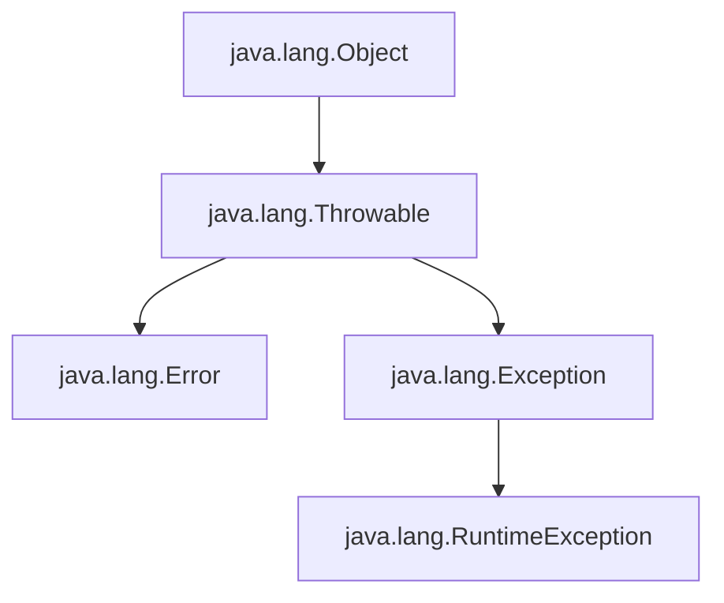
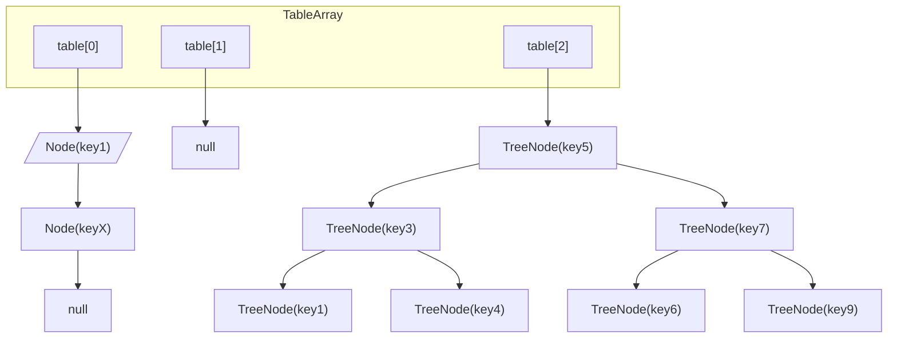
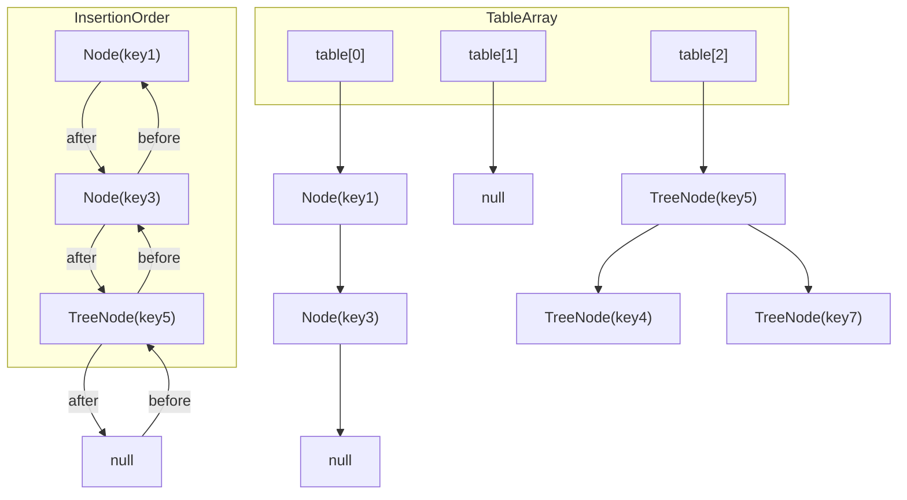

# Homework 2 — Collections & Exception Handling
**Author: M. Yang**

<details>
<summary>Table of Contents</summary>

1. [Checked Exception vs. Unchecked Exception](#question-2)
2. [`catch` & `finally`](#question-4)
3. [`throw` vs. `throws`](#question-5)
4. [`catch` Ordering](#question-6)
5. [`Optional`](#question-7)
6. [Design Patterns](#question-8)
7. [Singleton Pattern, Factory Pattern, Builder Pattern](#question-9)
8. [SOLID Principles](#question-10)
9. [`HashMap` vs `LinkedHashMap` vs `TreeMap`](#question-12)

</details>

## Question 1
See directory [Coding/HW2/Question1](../Coding/HW2/Question1).


## Question 2
> Checked Exception vs. Unchecked Exception

### Comparison
| Feature               | Checked Exception                                                                                        | Unchecked Exception                                                        |
|-----------------------|----------------------------------------------------------------------------------------------------------|----------------------------------------------------------------------------|
| Description           | **Must be declared or handled** in the method (`throws` or `try-catch`) because the compiler enforces it | No need to be declared or handled                                          |
| Inherits from         | `Exception`                                                                                              | `RuntimeException`                                                         |
| Checked when?         | **Compile time**                                                                                         | **Runtime**                                                                |
| Must be caught/thrown | Yes                                                                                                      | No                                                                         |
| Common Examples       | `IOException`, `SQLException`                                                                            | `NullPointerException`, `ArithmeticException`, `IndexOutOfBoundsException` |
| Represents            | Recoverable situations                                                                                   | Programming errors                                                         |



### Checked Exception Example (`IOException`)
```java
import java.io.*;

public class Main {
    public static void readFile(String fileName) throws IOException {
        FileReader file = new FileReader(fileName); // may throw IOException
        BufferedReader fileInput = new BufferedReader(file);

        System.out.println(fileInput.readLine());
        fileInput.close();
    }

    public static void main(String[] args) {
        try {
            readFile("nonexistence.txt");
        } catch (IOException e) {
            System.out.println("Caught checked exception: " + e.getMessage());
        }
    }
}
```

### Unchecked Exception Example (`ArithmeticException`)
```java
public class Main {
    public static void divide(int a, int b) {
        int result = a / b; // may throw ArithmeticException
        System.out.println("Result: " + result);
    }

    public static void main(String[] args) {
        try {
            divide(10, 0);
        } catch (ArithmeticException e) {
            System.out.println("caught unchecked exception: " + e.getMessage());
        }
    }
}
```


## Question 3
> `catch` and `finally` blocks

Java allows **multiple** `catch` blocks but **only one** `finally` block per `try`.
```java
public class Main {
    public static void main(String[] args) {
        try {
            int[] arr = {10, 20, 30};
            System.out.println(arr[arr.length]); // Throws ArrayIndexOutOfBoundsException
            int result = 10 / 0;        // Would throw ArithmeticException if reached
        } catch (ArithmeticException e) {
            System.out.println("Caught ArithmeticException: " + e.getMessage());
        } catch (ArrayIndexOutOfBoundsException e) {
            System.out.println("Caught ArrayIndexOutOfBoundsException: " + e.getMessage());
        } catch (Exception e) {
            System.out.println("Caught general Exception: " + e.getMessage());
        } finally {
            System.out.println("This is the finally block. It always executes.");
        }
    }
}
```


## Question 4
> The final result for `catch` and `finally` blocks.

When both `catch` and `finally` have return statements, the return value from `finally` takes precedence
and overrides any return from `try` or `catch`.


## Question 5
> `throw` vs. `throws`

| Feature        | `throw`                      | `throws`                                     |
|----------------|------------------------------|----------------------------------------------|
| What it does   | Actually throws an exception | Declares a method **might** throw exceptions |
| Used with      | Exception **object**         | Exception **class/type**                     |
| Location       | Inside method/block          | Method signature                             |
| Syntax Example | `throw new IOException();`   | `void read() throws IOException`             |


## Question 6
> `catch` blocking ordering rules

`catch` blocking ordering rules:
1. Checks `catch` **top to bottom** and uses the **first match**.
2. Catching `Exception` too early blocks all the remaining exceptions.

The oder of `catch block` in this question's example is correct:
- Catch more **specific** exceptions first (like `ArithmeticException`, `NullPointerException`)
- Then catch **more general** exceptions (`RuntimeException`)
- Finally, catch the **most general** ones (`Exception`)

[Example](#question-3)

## Question 7
> `Optional`

`Optional` is a container object used to represent **a value that may or may not be present**.
It's introduced in Java 8 to deal with null values in a more expressive and safer way.
Using `Optional` helps to avoid **NullPointerException (NPE)** by enforcing an explicit check for the presence of a value,
rather than relying on `null`.

```java
public class BooleanTest {
    
    private Boolean flag; // null (uninitialized)
    
    public boolean getFlag() {
        // return flag; // This causes NPE if implicit unboxing null flag (Boolean → boolean)
        return Optional.ofNullable(flag).orElse(false); // safe even if setFlag(null)
        
        // ofNullable(flag) returns Optional.empty() if null; otherwise Optional(flagValue)
        // Optional.empty().orElse(false) returns false
        // Optional(flagValue).orElse(false) returns flagValue
    }
    
    public void setFlag(Boolean flag) { // param flag may be null
        this.flag = flag;
    }
    
    public static void main(String[] args) {
        System.out.println(new BooleanTest().getFlag());
    }
}
```


## Question 8
> Creational Design Patterns and Structure Design Patterns

### Creational Design Patterns
Creational design patterns are used to abstract the instantiation process, ensuring that objects are created in a way that suits the context.
Some common creational patterns include:

<details>
<summary>Singleton Pattern</summary>

* Ensures that a class has only one instance and provides a global point of access to it.
* Example: Database connection manager, logging class.

</details>

<details>
<summary>Factory Method Pattern</summary>

* Defines an interface for creating an object, but allows subclasses to **alter the type of objects that will be created**.
* Example: GUI toolkit (buttons, checkboxes) where subclasses decide the specific button type.

</details>

<details>
<summary>Abstract Factory Pattern</summary>

* Provides an interface for creating families of related or dependent objects without specifying their concrete classes.
* Example: UI components across different platforms (Windows, macOS).

</details>

<details>
<summary>Builder Pattern</summary>

* Allows for the **step-by-step** creation of complex objects. The builder pattern provides flexibility in constructing different representations of an object.
* Example: Building a complex object like a meal, or constructing a configuration object.

</details>

<details>
<summary>Prototype Pattern</summary>

* Creates new objects by copying an existing object, known as the prototype. This pattern is useful when creating instances of a class is expensive.
* Example: Cloning objects that require a lot of resources.

</details>


### Structural Design Patterns
Structural patterns deal with the composition of objects or classes to form larger structures while keeping them flexible and efficient.
Common structural patterns include:

<details>
<summary>Adapter Pattern</summary>

* Allows incompatible interfaces to work together by providing a wrapper that translates one interface to another.
* Example: Converting an old system's API to work with a new system.

</details>

<details>
<summary>Decorator Pattern</summary>

* Allows additional behavior to be added to an object dynamically. This pattern is often used to extend functionalities of objects in a flexible way.
* Example: Adding extra features like scrollbars or borders to a graphical window.

</details>

<details>
<summary>Facade Pattern</summary>

* Provides a simplified interface to a complex system, making it easier to interact with.
* Example: A complex library with many components exposed through a simple API.

</details>

<details>
<summary>Composite Pattern</summary>

* Composes objects into tree-like structures to represent part-whole hierarchies. This allows clients to treat individual objects and compositions of objects uniformly.
* Example: A file system where files and directories are treated as components.

</details>

<details>
<summary>Bridge Pattern</summary>

* Separates abstraction from its implementation so that both can vary independently. This is particularly useful when there are multiple potential implementations for different abstractions.
* Example: Remote control for different types of devices (e.g., TVs, air conditioners).

</details>

<details>
<summary>Flyweight Pattern</summary>

* Reduces the memory usage by sharing common objects. It is used when many similar objects are created, and you want to minimize memory use.
* Example: Characters in a word processing application (e.g., multiple occurrences of the same character).

</details>

<details>
<summary>Proxy Pattern</summary>

* Provides an object representing another object to control access to it. This can be used for lazy loading, access control, or monitoring.
* Example: A virtual proxy for loading images in a web application only when needed.

</details>


## Question 9
> Singleton Pattern, Factory Pattern, Builder Pattern

### Singleton
```java
public class Singleton {
    private static volatile Singleton instance;

    private Singleton() {
        // private constructor to prevent instantiation
    }

    public static Singleton getInstance() {
        if (instance == null) {                     // 1st check (no locking): returns quickly if no lock, avoid overhead
            synchronized (Singleton.class) { // locked
                if (instance == null) {             // 2nd check (with locking): ensure only 1 thread creates instance
                    instance = new Singleton();
                }
            } // unlocked
        }
        return instance;
    }
}
```
**Thread-Safety Explanation:**
* `volatile` ensures visibility of changes to instance across threads.
* Double-checked locking reduces the performance cost of acquiring a lock.
* Synchronization is only used during the first creation.

### Factory
```java
// Product Interface
interface Shape {
    void draw();
}

// Concrete Products
class Circle implements Shape {
    public void draw() {
        System.out.println("Drawing a Circle");
    }
}

class Square implements Shape {
    public void draw() {
        System.out.println("Drawing a Square");
    }
}

// Factory Class
class ShapeFactory {
    public static Shape getShape(String type) {
        if (type == null) return null;
        if (type.equalsIgnoreCase("circle")) return new Circle();
        if (type.equalsIgnoreCase("square")) return new Square();
        return null;
    }
}

// Usage
public class Main {
    public static void main(String[] args) {
        Shape shape1 = ShapeFactory.getShape("circle");
        shape1.draw();  // Output: Drawing a Circle

        Shape shape2 = ShapeFactory.getShape("square");
        shape2.draw();  // Output: Drawing a Square
    }
}
```

### Builder
```java
class Computer {
    // Required parameters
    private final String CPU;
    private final String RAM;

    // Optional parameters
    private final boolean hasSSD;
    private final boolean hasGPU;

    private Computer(Builder builder) {
        this.CPU = builder.CPU;
        this.RAM = builder.RAM;
        this.hasSSD = builder.hasSSD;
        this.hasGPU = builder.hasGPU;
    }

    public static class Builder {
        private final String CPU;
        private final String RAM;
        private boolean hasSSD = false;
        private boolean hasGPU = false;

        public Builder(String CPU, String RAM) {
            this.CPU = CPU;
            this.RAM = RAM;
        }

        public Builder withSSD(boolean val) {
            this.hasSSD = val;
            return this;
        }

        public Builder withGPU(boolean val) {
            this.hasGPU = val;
            return this;
        }

        public Computer build() {
            return new Computer(this);
        }
    }

    public void specs() {
        System.out.println("CPU: " + CPU + ", RAM: " + RAM + ", SSD: " + hasSSD + ", GPU: " + hasGPU);
    }
}

// Usage
public class Main {
    public static void main(String[] args) {
        Computer gamingPC = new Computer.Builder("Intel i9", "32GB")
                .withSSD(true)
                .withGPU(true)
                .build();

        gamingPC.specs(); // Output: CPU: Intel i9, RAM: 32GB, SSD: true, GPU: true
    }
}
```


## Question 10
> SOLID Principles

### SOLID Principles
The SOLID principles are a set of five design principles intended to make software more maintainable, scalable, and robust.

| Principle | Name                            | Definition                                                                                          |
|-----------|---------------------------------|-----------------------------------------------------------------------------------------------------|
| S         | Single Responsibility Principle | A class should have only one reason to change.                                                      |
| O         | Open-Closed Principle           | Software entities should be open for extension but closed for modification.                         |
| L         | Liskov Substitution Principle   | Subtypes must be substitutable for their base types without altering correctness.                   |
| I         | Interface Segregation Principle | No client should be forced to depend on methods it does not use.                                    |
| D         | Dependency Inversion Principle  | Depend on abstractions, not concretions. High-level modules should not depend on low-level modules. |


> Open-Closed Principle (OCP)
> 
> *Software entities (classes, modules, functions, etc.) should be open for extension, but closed for modification.*

This means that existing code should not be changed, but the behavior should be extendable to accommodate new requirements. This reduces the risk of introducing bugs in existing functionality and promotes maintainability.


## Question 11
> Liskov Substitution Principle (LSP)
> 
> *If class B is a subtype of class A, then object of type A may be substituted with any object of type B.*

This means that if the object of type A can do something, the object of type B can also do it.


## Question 12
> `HashMap` vs `LinkedHashMap` vs `TreeMap`
> - `HashSet<E>` uses a `HashMap<E, Object>` internally

| Feature                  | `HashMap`                                                                                              | `LinkedHashMap`                                                                                | `TreeMap`                                          |
|--------------------------|--------------------------------------------------------------------------------------------------------|------------------------------------------------------------------------------------------------|----------------------------------------------------|
| **Underlying Structure** | **Resizable** array of buckets; each bucket is a singly linked list or red-black tree (for collisions) | Same as HashMap **plus** a **global doubly** linked list linking all entries to preserve order | Red-black tree (self-balancing binary search tree) |
| Order                    | Unordered                                                                                              | Insertion / Access order                                                                       | Sorted by key                                      |
| Performance (get/put)    | `O(1)` avg                                                                                             | `O(1)` avg                                                                                     | `O(log n)`                                         |
| Null Keys                | 1 allowed                                                                                              | 1 allowed                                                                                      | Not allowed                                        |
| Null Values              | Allowed                                                                                                | Allowed                                                                                        | Allowed                                            |
| Thread Safety            | Not thread-safe                                                                                        | Not thread-safe                                                                                | Not thread-safe                                    |
| Use Case                 | **Fast** lookups                                                                                       | Order **preservation**                                                                         | **Sorted** keys                                    |

### `HashMap` Structure


### `LinkedHashMap` Structure
