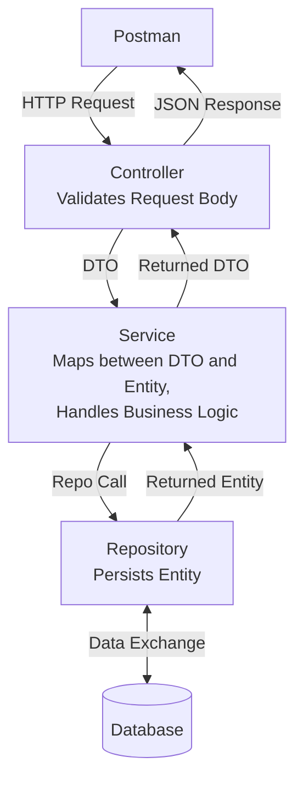

# Homework 6 — Spring Boot Introduction
**Author: M. Yang**

## Question 1
> Common Spring Boot Annotations

See [Spring-Boot-Annotations.md](Spring-Boot-Annotations.md).

## Question 2
> Explain how `@Column` defines a column in the example below.
> ```java
> @Column(columnDefinition = "varchar(255) default 'John Snow'")
> private String name;
> 
> @Column(name="STUDENT_NAME", length=50, nullable=false, unique=false)
> private String studentName;
> ```

| Field         | Column Name      | Type           | Default Value      | Nullable | Unique  |
|---------------|------------------|----------------|--------------------|----------|---------|
| `name`        | `name` (default) | `varchar(255)` | `'John Snow'`      | `true`   | `false` |
| `studentName` | `STUDENT_NAME`   | `varchar(50)`  | *(none specified)* | `false`  | `false` |

JPA will throw an error if `studentName` is null during persist
(because of `nullable = false` and no default value is specified).

## Question 3
> What would be the default column names for the columns below?
> ```java
> @Column
> private String firstName;
> 
> @Column
> private String operatingSystem;
> ```

| Field             | Column Name       |
|-------------------|-------------------|
| `firstName`       | `firstName`       |
| `operatingSystem` | `operatingSystem` |


## Question 4
> Layers in Spring Boot applications

| Layer          | Key Annotation                       | Responsibility                                                                    |
|----------------|--------------------------------------|-----------------------------------------------------------------------------------|
| Presentation   | `@Controller`, `@RestController`     | Handle HTTP requests/responses                                                    |
| Service        | `@Service`                           | Business logic                                                                    |
| Data Access    | `@Repository`                        | Database operations                                                               |
| Model/Entity   | `@Entity`                            | Represents database tables                                                        |
| DTO (Optional) | Plain POJO classes (no specific one) | Shapes data exchanged with external systems and between controllers and services. |


## Question 5
> Data flow in Spring Boot Application Layers




## Question 6
> `application.properties` vs `application.yml`

Both `application.properties` and `application.yml` are **configuration files** in a Spring Boot application.
They serve the same purpose: to define application-level settings and environment-specific values—but they use **different formats**.

### Example

`application.properties`
```properties
server.port=8081
spring.datasource.url=jdbc:mysql://localhost:3306/mydb
spring.datasource.username=root
spring.datasource.password=secret
```

`application.yml`
```yaml
server:
  port: 8081

spring:
  datasource:
    url: jdbc:mysql://localhost:3306/mydb
    username: root
    password: secret
```


## Question 7
> Naming: REST APIs vs GraphQL

| Aspect          | REST                                             | GraphQL                                                   |
|-----------------|--------------------------------------------------|-----------------------------------------------------------|
| Endpoint Naming | Resource-based (e.g., `/users`, `courses`, etc.) | Single endpoint (e.g., `/graphql`)                        |
| Action Naming   | HTTP verbs                                       | Explicit Operations (e.g., `getUser`, `createUser`, etc.) |
| Philosophy      | protocol-driven (compliance with HTTP semantics) | query-driven (client-defined API behavior in the query)   |

### Example

#### REST
```http request
GET /users/1
POST /users
```

#### GraphQL
```graphql
query {
    getUser(id: 1) {
        name
    }
}

mutation {
    createUser(name: "Alice") {
        id
    }
}
```


## Question 8
> N+1 problem: REST APIs vs GraphQL
> 
> N+1 problem:
> - A query is performed to get a list of records, and later many queries for each of those records.
> - It’s a performance killer — especially over the network or with large datasets.

### Example 1: Users and Their Posts

#### ◾ REST (N+1 Problem)
1. A request is made to retrieve all users:
    ```http request
    GET /users
    ```
2. For each user in the response, an additional request is issued to retrieve the corresponding posts:
    ```http request
    GET /users/1/posts
    GET /users/2/posts
    ```

#### ◾ GraphQL Solution
A single GraphQL query can retrieve users along with their associated posts:
```graphql
query {
  users {
    id
    name
    posts {
      id
      title
    }
  }
}
```


### Example 2: Products and Their Reviews

#### ◾ REST (N+1 Problem)
1. A request is issued to retrieve all products:
    ```http request
    GET /products
    ```
2. For each product in the result set, an additional request is made to retrieve its reviews:
    ```http request
    GET /products/1/reviews
    GET /products/2/reviews
    ```

#### ◾ GraphQL Solution
GraphQL can retrieve products and their related reviews using a single nested query:
```graphql
query {
  products {
    id
    name
    reviews {
      id
      comment
      rating
    }
  }
}
```


## Question 9
> Implement the API below 
> - REST API: DELETE post by ID (with exceptions)
> - GraphQL: Query getAllPost

### REST

<details>
<summary>Exception Handler</summary>

```java
// src/main/java/com/example/demo/exception/PostNotFoundException.java
package com.example.demo.exception;

public class PostNotFoundException extends RuntimeException {
    public PostNotFoundException(String message) {
        super(message);
    }
}
```
</details>

<details>
<summary>Entity</summary>

```java
// src/main/java/com/example/demo/entity/Post.java
package com.example.demo.entity;

import jakarta.persistence.*;

@Entity
@Table(name = "posts")
public class Post {
    @Id
    @GeneratedValue(strategy = GenerationType.IDENTITY)
    private Long id;

    private String title;
    private String content;

    // Getters & Setters
}
```
</details>

<details>
<summary>Controller</summary>

```java
// src/main/java/com/example/demo/controller/PostController.java
package com.example.demo.controller;

import com.example.demo.exception.PostNotFoundException;
import com.example.demo.service.PostService;
import org.springframework.beans.factory.annotation.Autowired;
import org.springframework.http.HttpStatus;
import org.springframework.http.ResponseEntity;
import org.springframework.web.bind.annotation.*;

@RestController
@RequestMapping("/api/posts")
public class PostController {
    @Autowired
    private PostService postService;

    @DeleteMapping("/{id}")
    public ResponseEntity<?> deletePost(@PathVariable Long id) {
        try {
            postService.deletePost(id);
            return ResponseEntity.ok().build();
        } catch (PostNotFoundException ex) {
            return ResponseEntity.status(HttpStatus.NOT_FOUND).body(ex.getMessage());
        }
    }
}
```
</details>

<details>
<summary>Service</summary>

```java
// src/main/java/com/example/demo/service/PostService.java
package com.example.demo.service;

import com.example.demo.exception.PostNotFoundException;
import com.example.demo.entity.Post;
import com.example.demo.repository.PostRepository;
import org.springframework.beans.factory.annotation.Autowired;
import org.springframework.stereotype.Service;

@Service
public class PostService {
    @Autowired
    private PostRepository postRepository;

    public void deletePost(Long id) {
        Post post = postRepository.findById(id)
            .orElseThrow(() -> new PostNotFoundException("Post not found with id: " + id));
        postRepository.delete(post);
    }
}
```
</details>

<details>
<summary>Repository</summary>

```java
// src/main/java/com/example/demo/repository/PostRepository.java
package com.example.demo.repository;

import com.example.demo.entity.Post;
import org.springframework.data.jpa.repository.JpaRepository;

public interface PostRepository extends JpaRepository<Post, Long> { }
```
</details>


### GraphQL

<details>
<summary>Dependency</summary>

```xml
<dependency>
    <groupId>org.springframework.boot</groupId>
    <artifactId>spring-boot-starter-graphql</artifactId>
</dependency>
```
</details>

<details>
<summary>Schema</summary>

```graphql
# src/main/resources/graphql/schema.graphqls
type Post {
    id: ID!
    title: String!
    content: String!
}

type Query {
    getAllPosts: [Post!]!
}
```
</details>

<details>
<summary>Controller</summary>

```java
// src/main/java/com/example/demo/controller/PostGraphQLController.java
package com.example.demo.controller;

import com.example.demo.model.Post;
import com.example.demo.repository.PostRepository;
import org.springframework.beans.factory.annotation.Autowired;
import org.springframework.graphql.data.method.annotation.QueryMapping;
import org.springframework.stereotype.Controller;

import java.util.List;

@Controller
public class PostGraphQLController {
    @Autowired
    private PostRepository postRepository;

    @QueryMapping
    public List<Post> getAllPosts() {
        return postRepository.findAll();
    }
}
```
</details>


## Question 10
> A mini Spring Boot Application with a POST API backed by MongoDB.

### Create Post


### Get All Posts


### Get Post by ID
#### ◾ 200 OK


#### ◾ 404 Not Found (Exception Handled)


### Put Post by ID
#### ◾ 200 OK


#### ◾ 404 Not Found (Exception Handled)


### Delete Post by ID
#### ◾ 200 OK


#### ◾ 404 Not Found (Exception Handled)


